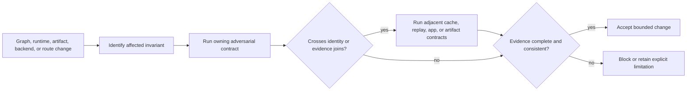

# DAG Architecture Risks

These risks describe how a structural defect can invalidate DAG evidence. The
release-facing [Risk Register](../quality/risk-register.md) owns severity,
current status, mitigation, and ship/block decisions; this page owns the
architecture path from defect to observable harm.

## Failure Propagation

| Structural defect | Propagation | Detection boundary | Release risk |
| --- | --- | --- | --- |
| graph identity includes ambient or non-semantic inputs | cache keys, run identity, replay, and diff classify unchanged work as changed or changed work as equal | graph identity, fingerprint property, mutation, and runtime identity contracts | `RISK-003`, `RISK-004`, `RISK-005` |
| scheduler order or state transitions are nondeterministic | equivalent inputs produce incomparable execution records or impossible terminal states | scheduler determinism, ordering/fairness, execution timeline, and state-machine contracts | `RISK-005`, `RISK-010` |
| artifact writes are partial, unrooted, or accepted without integrity | replay consumes missing, corrupted, or host-escaped evidence | artifact hardening, storage resilience, lineage, import corruption, and traversal contracts | `RISK-004`, `RISK-005`, `RISK-006` |
| backend capabilities are inferred instead of declared | a modeled or unsupported lane appears equivalent to stable local execution | backend capability, node execution mode, container, batch, and adapter contracts | `RISK-001`, `RISK-002`, `RISK-009` |
| application routes erase unknown or incomplete states | inspect, replay, or diff reports confidence unsupported by retained evidence | replay semantic surface, replay proof, route response, and run completion contracts | `RISK-005` |
| public and private command lanes blur | users automate experimental or simulated routes as stable behavior | generated reference, root help, command lane, and release-boundary contracts | `RISK-002`, `RISK-009` |

## Containment Flow

The important joins are where one crate's output becomes another crate's
truth: graph to plan, plan to attempt, provisional backend output to durable
evidence, retained evidence to replay, and application response to operator
claim.

## Proof Requirements

### Identity changes

Review which fields affect graph, plan, execution, and evidence identity. Show
that field order, map order, working directory, and unrelated Git state do not
alter identity unless the contract declares them semantic. Update cache and
replay evidence when an identity input intentionally changes.

### Execution changes

Show scheduler decisions, state transitions, retries, blocked-node behavior,
and finalization. A successful process exit is insufficient if the run record
cannot explain node outcomes or distinguish completion from interruption.

### Artifact changes

Show rooted path validation, atomic or recoverable writes, content integrity,
lineage, retention behavior, and corrupt-import refusal. A file's presence is
not proof that it is complete or belongs to the run.

### Backend changes

State the capability level before sharing an interface across local, container,
batch, remote, or modeled execution. Common types do not imply equivalent
isolation, scheduling, cancellation, provenance, or recovery semantics.

### Replay and comparison changes

Preserve explicit equivalent, changed, incomplete, incompatible, and unknown
outcomes. Do not turn missing evidence into equality, success, or an empty
difference.

## Stop Conditions

| Finding | Required decision |
| --- | --- |
| semantic identity changes without an explicit contract change | block cache, replay, and compatibility claims |
| a scheduler outcome cannot be reconstructed from retained transitions | block deterministic execution claims |
| output exists outside declared rooted storage or lacks accepted integrity | reject the artifact and the run evidence that depends on it |
| backend capability or identity is missing | refuse execution or classify the result as unsupported; do not infer local equivalence |
| replay lacks source evidence required by its contract | return incomplete or incompatible, never success |
| a route is absent from the stable release truth table | keep it experimental, simulated, internal, or unreleased as governed |

## Evidence Standard

For the reviewed commit, retain the focused contract results and the broad lane
required by the affected release surface. Generated reports from another source
revision and ignored tests outside their governed lane cannot support a stable
claim.

If mitigation remains incomplete, update the existing record in the
[Risk Register](../quality/risk-register.md). Do not create a parallel risk
ledger in architecture docs, weaken a contract to match current behavior, or
describe a modeled capability as shipped.

## Verification Sources

- `crates/bijux-dag-core/tests/graph_identity_contract.rs`
- `crates/bijux-dag-runtime/tests/runtime_scheduler_determinism_contracts.rs`
- `crates/bijux-dag-runtime/tests/state_machine_contracts.rs`
- `crates/bijux-dag-artifacts/tests/artifact_hardening_contracts.rs`
- `crates/bijux-dag-app/tests/replay_semantic_surface_contracts.rs`
- [Test Strategy](../quality/test-strategy.md)
