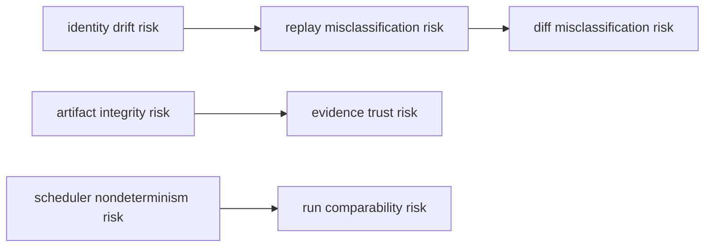

# Architecture Risks

These are the highest-impact risks for DAG trust. If they regress, replay/diff
confidence and release decisions degrade quickly.

## Visual Summary

## Active Risk Areas

- canonicalization or fingerprint drift without matching contract updates
- scheduler nondeterminism that breaks replay comparability
- artifact lineage gaps or hash mismatches hidden by weak checks
- capability downgrade paths masking incomplete/unknown states

## Code Anchors

- `crates/bijux-dag-core/src/analysis/fingerprint.rs`
- `crates/bijux-dag-runtime/src/runtime_core/execution/scheduler.rs`
- `crates/bijux-dag-runtime/src/replay/`
- `crates/bijux-dag-artifacts/src/integrity/`
- `crates/bijux-dag-app/src/routes/diff_routes.rs`

## Mitigation Focus

- keep identity and replay contracts under dedicated tests
- preserve explicit unknown/incomplete states in outputs
- verify artifact integrity before accepting replay/diff conclusions

The operational release decisions for these architecture risks are tracked in
`RISK-003`, `RISK-004`, and `RISK-005` in
[Risk Register](../quality/risk-register.md).

## Next Reads

- [Risk Register](../quality/risk-register.md)
- [Test Strategy](../quality/test-strategy.md)
- [Change Validation](../quality/change-validation.md)
