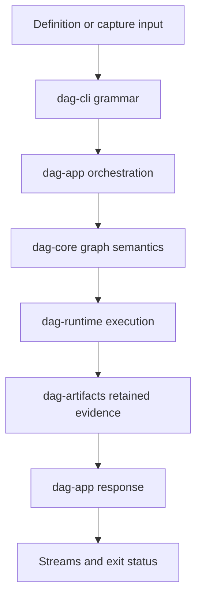

# Code Navigation

Use this map to reach the right DAG module quickly based on the question you are
answering.

## Visual Summary

The arrows describe dependency and result flow, not permission to move
responsibility upward. The command layer does not own graph meaning, and the
application layer does not own scheduler or artifact invariants.

## Navigate By Question

| Question | Start in | Follow with |
| --- | --- | --- |
| why is this graph accepted or refused? | `crates/bijux-dag-core/src/pipeline/` | core contract tests and validation error definitions |
| why did canonical identity change? | `crates/bijux-dag-core/src/analysis/` | identity fixtures and artifact consumers |
| why was a node selected, retried, or cancelled? | `crates/bijux-dag-runtime/src/runtime_core/execution/` | scheduler timeline and runtime contract tests |
| why does replay or diff classify a run this way? | `crates/bijux-dag-runtime/src/replay/` | retained artifact schema and comparison tests |
| why is evidence missing or rejected? | `crates/bijux-dag-artifacts/src/` | integrity, lineage, and schema tests |
| why does inspect or status render this result? | `crates/bijux-dag-app/src/inspect/` | response contracts and command integration tests |
| why does a route accept these arguments? | `crates/bijux-dag-app/src/routes/` and `crates/bijux-dag-cli/src/` | command-surface snapshots and process tests |

## Change Tracing

Start at the lowest layer that owns the invariant, then trace outward:

1. Locate the domain or runtime definition.
2. Find focused tests in the same crate that prove the invariant.
3. Find serialization or artifact consumers before changing a persisted shape.
4. Find application mapping before changing a public response.
5. Find command and process tests before changing streams or exit status.
6. Update public documentation only to claims supported by those anchors.

Searching only for rendered wording is insufficient. The same concept can
appear in graph validation, retained evidence, an application response, and a
CLI table while having exactly one semantic owner.

## Test Navigation

- app contracts: `crates/bijux-dag-app/tests/`
- core contracts: `crates/bijux-dag-core/tests/`
- runtime contracts: `crates/bijux-dag-runtime/tests/`
- artifact contracts: `crates/bijux-dag-artifacts/tests/`

## Boundary Smells

- command parsing determines graph validity;
- application routes mutate scheduler state directly;
- runtime code formats operator-facing tables;
- artifact readers infer missing provenance from ambient repository state;
- replay compares current implementation state instead of retained evidence;
- tests duplicate production algorithms to calculate the expected answer.

## Next Reads

- [Module Map](module-map.md)
- [Entrypoints and Examples](../interfaces/entrypoints-and-examples.md)
- [Error Codes](../interfaces/error-codes.md)
- [Review Checklist](../quality/review-checklist.md)
