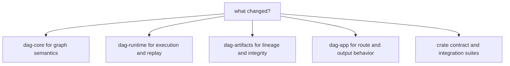

# Code Navigation

Use this map to reach the right DAG module quickly based on the question you are
answering.

## Visual Summary

## Navigation Paths by Problem

- graph parse/validation behavior: `crates/bijux-dag-core/src/pipeline/`
- identity/canonicalization behavior: `crates/bijux-dag-core/src/analysis/`
- runtime scheduling/execution: `crates/bijux-dag-runtime/src/runtime_core/execution/`
- replay/diff logic: `crates/bijux-dag-runtime/src/replay/`
- inspect/status output behavior: `crates/bijux-dag-app/src/inspect/`
- route command behavior: `crates/bijux-dag-app/src/routes/`

## Test Navigation

- app contracts: `crates/bijux-dag-app/tests/`
- core contracts: `crates/bijux-dag-core/tests/`
- runtime contracts: `crates/bijux-dag-runtime/tests/`
- artifact contracts: `crates/bijux-dag-artifacts/tests/`

## Next Reads

- [Module Map](module-map.md)
- [Entrypoints and Examples](../interfaces/entrypoints-and-examples.md)
- [Error Codes](../interfaces/error-codes.md)
- [Review Checklist](../quality/review-checklist.md)
