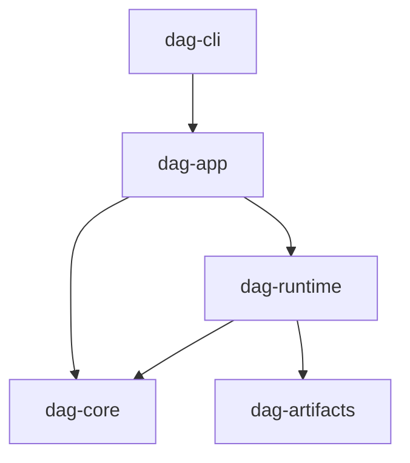

# Dependency Direction

Dependency direction is part of DAG correctness. It prevents semantic logic from
absorbing runtime side effects and prevents CLI wrappers from owning core rules.

## Visual Summary

## Direction Rules

- `dag-core` must not depend on runtime, app, or cli layers.
- `dag-runtime` may depend on core and artifacts only.
- `dag-app` orchestrates runtime/core/artifacts, but owns no core semantics.
- `dag-cli` remains thin and delegates behavior to app commands.

## Guardrails

- no direct filesystem/process/env reads inside pure core semantics paths
- no app-level response formatting logic inside runtime execution modules
- no artifact schema rewrites outside `dag-artifacts`

## Code Anchors

- `crates/bijux-dag-core/CONTRACT.md`
- `crates/bijux-dag-runtime/CONTRACT.md`
- `crates/bijux-dag-app/CONTRACT.md`
- `crates/bijux-dag-cli/src/main.rs`

## Next Reads

- [Execution Model](execution-model.md)
- [Integration Seams](integration-seams.md)
- [Dependency Governance](../quality/dependency-governance.md)
