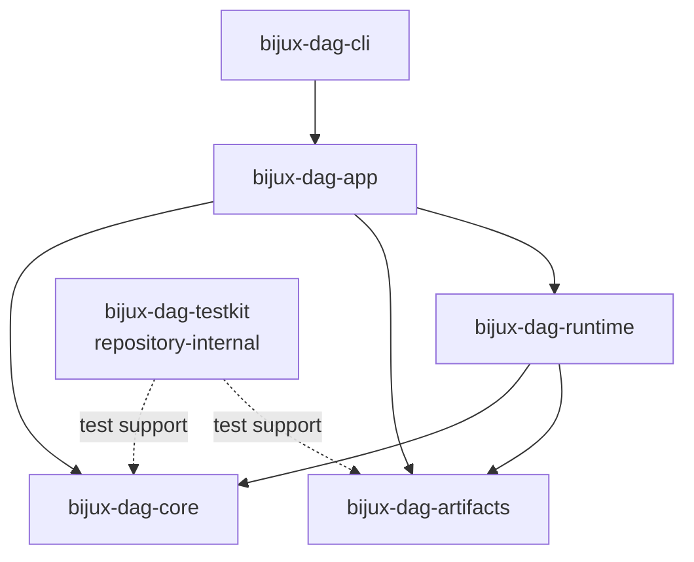

# Dependency Direction

Dependency direction is part of the product contract. It keeps graph meaning
independent of execution effects, gives artifact formats one owner, and
prevents process wiring from becoming an application layer.

## Exact Workspace Graph

The normal Cargo dependencies among DAG crates are:

`bijux-dag-core` and `bijux-dag-artifacts` are independent leaves in this
family. Runtime combines their contracts. App combines core, runtime, and
artifact services into command behavior. CLI depends only on app.

`bijux-dag-testkit` is not a public runtime layer. Its core and artifact edges
provide deterministic fixtures and assertions to repository tests. Production
packages must not acquire a normal dependency on it.

## What Each Direction Permits

| From | Allowed DAG dependencies | Owned behavior |
| --- | --- | --- |
| `bijux-dag-core` | none | graph model, parsing, resolution, canonicalization, validation, topology, planning, and semantic identity |
| `bijux-dag-artifacts` | none | run evidence models, storage layout, persistence, integrity, lineage, retention, and promotion |
| `bijux-dag-runtime` | core and artifacts | scheduling, execution, adapters, runtime policy, cache decisions, replay, and diagnostics |
| `bijux-dag-app` | core, artifacts, and runtime | command orchestration, typed responses, input/output shaping, inspect, repair, replay, and rendering |
| `bijux-dag-cli` | app | process startup and final error-to-exit mapping |
| `bijux-dag-testkit` | core and artifacts | repository-only deterministic builders, fixtures, and assertions |

An allowed Cargo edge does not transfer ownership. App may call core validation,
but cannot redefine graph validity. Runtime may persist through artifacts, but
cannot create a competing run-manifest format.

## Effect Boundaries

- Core source must not read files, environment variables, wall-clock time, or
  launch processes.
- Artifact IO is permitted only through the artifact crate's owned storage and
  integrity APIs; model and proof semantics stay testable separately from a
  concrete filesystem.
- Runtime subprocesses and ambient inputs must cross explicit backend, adapter,
  policy, or execution-context boundaries.
- App owns user-facing response models and rendering. Runtime errors retain
  domain classification instead of printing command output directly.
- CLI remains wiring. A command implementation in the binary crate is a
  misplaced application concern.

## Enforcement

Cargo manifests are the compile-time authority. Package contracts define the
semantic boundary, and focused tests reject forbidden source and dependency
edges:

- `crates/bijux-dev/tests/foundation_dag_dependency_direction_contracts.rs`
- `crates/bijux-dev/tests/dependency_boundary_contracts.rs`
- `crates/bijux-dev/tests/no_runtime_in_core.rs`
- `crates/bijux-dev/tests/no_cli_in_runtime.rs`
- `crates/bijux-dag-app/tests/crate_boundary_contract.rs`
- `crates/bijux-dag-app/tests/service_boundary_contract.rs`

Review both kinds of evidence. A legal Cargo dependency can still conceal
semantic leakage, while source-folder purity cannot compensate for a forbidden
manifest edge.

## Next Reads

- [Module Map](module-map.md)
- [Execution Model](execution-model.md)
- [Integration Seams](integration-seams.md)
- [Dependency Governance](../quality/dependency-governance.md)
