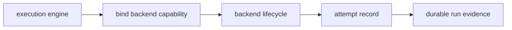

# Engine Backend Responsibilities

The runtime engine decides orchestration order; execution backends implement the
backend lifecycle for a node attempt.

## Responsibility split

## Engine owns

- backend capability binding
- backend context construction
- lifecycle ordering
- undeclared output rejection
- attempt recording and overall outcome classification

## Backend owns

- backend name and capability declaration
- prepare, launch, observe, finalize, and cleanup behavior
- backend-specific stdout, stderr, status, and exit code reporting

## Current proof surfaces

- `crates/bijux-dag-runtime/src/backend/runtime/execution_backend.rs`
- `crates/bijux-dag-runtime/tests/execution_backend_contract.rs`
- `crates/bijux-dag-runtime/tests/engine_flow_contract.rs`
- `docs/spec/BACKEND_CONTRACT.md`
