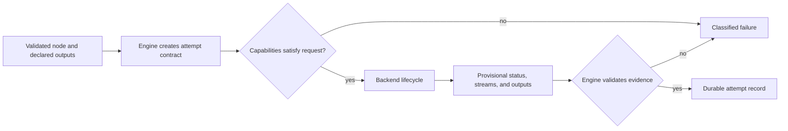
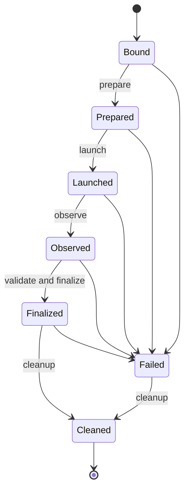

# Engine Backend Responsibilities

The execution engine decides what an attempt means. An execution backend
performs the substrate-specific lifecycle needed to run it. Keeping those
authorities separate lets local process, container, and modeled backend
implementations vary without changing accepted run state.

## Responsibility Split

| Engine authority | Backend authority |
| --- | --- |
| derive the required backend kind from the node | declare backend kind and capabilities |
| construct attempt identity, arguments, environment, and declared outputs | prepare the substrate for that attempt |
| reject capability mismatches before launch | launch and observe the command or job |
| enforce lifecycle order and failure precedence | report status, exit code, streams, and provisional outputs |
| validate produced outputs against declarations | finalize substrate-specific evidence |
| accept an attempt into durable run state | release backend-owned resources during cleanup |

The planner does not select scheduler-specific status semantics, and a backend
does not decide whether an attempt's evidence is authoritative.

## Authority Flow



The backend never writes itself into accepted run truth. It returns
observations to the engine, which checks output declarations, lifecycle
completion, and failure precedence before a durable record is created.

## Binding Before Effects

`BackendBindingRequest` names the node and required `BackendKind`.
`bind_backend_or_error` compares that request with the backend's
`BackendCapabilities`. A mismatch returns `BackendError::Capability` before
`prepare` or any later lifecycle method can create effects.

The capability registry is an inspectable declaration, not proof of sandbox
strength or production support. Shell and process backends are local subprocess
boundaries. Container execution can enforce engine-managed mounts and network
policy, but it is not presented as a virtual-machine security boundary.

## Attempt Lifecycle

For each node, `execute_with_backend` runs:

```text
bind -> prepare -> launch -> observe -> validate outputs -> finalize -> cleanup
```

`observe` returns a `BackendLifecycleResult` with node status, exit code,
standard streams, and produced outputs. The engine rejects any produced output
that was not declared in `BackendContext`; backend finalization cannot turn an
unauthorized path into accepted evidence.

Cleanup always runs after lifecycle work begins. If lifecycle work fails, that
primary failure remains the result even if cleanup also fails. If lifecycle
work succeeds and cleanup fails, cleanup failure becomes the attempt result.
Only a fully accepted lifecycle produces an `ExecutionAttemptRecord`.



The diagram shows lifecycle order, not a claim that every substrate exposes
the same native states. Backends translate substrate observations into the
shared result contract without hiding their backend identity.

## Failure Semantics

The error classes preserve where execution failed:

- `Capability` means no compatible backend was bound.
- `Prepare` and `Launch` identify pre-execution or start failures.
- `Observe` and `ObserveTimeout` distinguish status collection from timeout.
- `Finalize` includes rejected or invalid output evidence.
- `Cleanup` means execution completed but resource release did not.

## Observation And Backpressure

A backend may observe a long-lived external job without granting it immediate
controller acceptance. The controller must remain able to distinguish:

| Substrate observation | Controller interpretation |
| --- | --- |
| launch accepted | an external identity exists; the node is not yet successful |
| pending or queued | capacity belongs to the substrate; the node remains non-terminal |
| running | work is active; timeout and cancellation policy still apply |
| successful exit | output and lifecycle evidence are provisional |
| failed, timed out, or cancelled | terminal cause must be mapped without erasing substrate detail |
| unreachable or unknown | evidence is insufficient; success cannot be inferred |
| cleanup failure | resource ownership remains unresolved even if execution completed |

Polling intervals, scheduler queues, API availability, and external rate limits
can delay observation. Backends must surface that delay through their lifecycle
and errors; they must not synthesize completion to keep the controller moving.
The controller’s bounded queue protects local orchestration, while cluster
backpressure remains an explicit substrate condition.

## Why This Boundary Matters

- operators can distinguish substrate failure from orchestration failure
- new backends must conform to one lifecycle and evidence contract
- output authorization remains engine-owned across every substrate
- replay and inspection read accepted records rather than provisional backend
  state

## Backend Adoption Standard

A backend is not release-ready merely because it implements the lifecycle
trait. Promotion requires:

1. a declared capability set and fail-before-effects binding tests;
2. real execution evidence for the named substrate, not only mocks;
3. deterministic mapping for submission, observation, timeout, cancellation,
   and cleanup failures;
4. authorized output collection with rooted paths and integrity checks;
5. retained backend and workload identity sufficient for inspection;
6. compatibility behavior for replay and comparison;
7. operator prerequisites, unsupported conditions, and recovery guidance;
8. conformance plus substrate-specific tests in the governed lane.

Shared-filesystem assumptions for SLURM and persistent-volume assumptions for
Kubernetes are part of those bounded contracts. They must be diagnosed
explicitly rather than generalized into support for arbitrary clusters.

## Implementation and Proof

- implementation: `crates/bijux-dag-runtime/src/backend/runtime/execution_backend.rs`
- governing contracts: `docs/spec/BACKEND_CONTRACT.md` and
  `docs/spec/EXECUTION_ENGINE_CONTRACT.md`
- attempt schema: `docs/spec/ATTEMPT_TRACE_SCHEMA.md`
- conformance: `crates/bijux-dag-runtime/tests/execution_backend_contract.rs`
- engine integration: `crates/bijux-dag-runtime/tests/engine_flow_contract.rs`

Any backend addition must define capabilities, preserve lifecycle and cleanup
ordering, retain error classification, and pass conformance before it can
support release claims.
