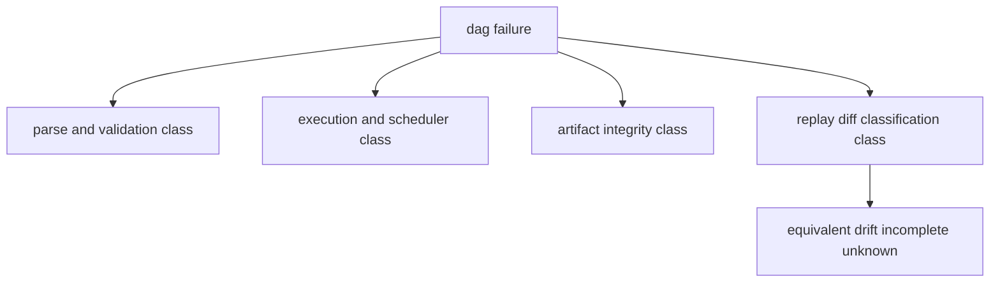

# Error Model

DAG error handling must preserve classification clarity: parse/validation errors,
execution errors, integrity errors, and classification-state errors must remain
distinguishable.

## Visual Summary

## Error Classes

- definition errors: malformed graph, unresolved dependencies, cycles
- runtime errors: node execution failure, scheduler/runtime interruption
- artifact errors: hash mismatch, missing lineage, storage corruption
- comparison errors: missing evidence, capability conflict, unsupported scope

## Code Anchors

- `crates/bijux-dag-core/src/contracts/error.rs`
- `crates/bijux-dag-runtime/src/error/`
- `crates/bijux-dag-artifacts/src/lib.rs`
- `crates/bijux-dag-app/src/routes/response.rs`

## Error Rules

- do not coerce unresolved state into success-equivalent output
- keep reason codes stable for automation and operator triage
- include enough context to drive replay/diff follow-up commands

## Next Reads

- [Error Codes](../interfaces/error-codes.md)
- [Data Contracts](../interfaces/data-contracts.md)
- [Failure Recovery](../operations/failure-recovery.md)
- [Invariants](../quality/invariants.md)
