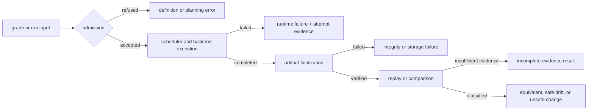

# Error Model

An error must retain enough identity to answer three questions: which boundary
refused or failed, whether any side effect occurred, and what evidence is safe
to reuse. A message alone is not an error contract. Stable automation depends
on typed failure classes, reason codes, process status, and retained run state
remaining consistent.

## Failure Propagation

Refusal before admission must not create a successful run record. Failure after
admission must leave enough attempt and finalization evidence to distinguish a
failed node from a damaged run directory. Comparison is a read path: missing
evidence produces an incomplete classification, not invented equivalence.

## Owned Error Classes

| Boundary | Representative failure | Owning type or surface | Required operator fact |
| --- | --- | --- | --- |
| graph definition | malformed input, unknown dependency, cycle, invalid identity | `bijux_dag_core::GraphError` and planner errors | input was rejected before execution |
| planning and admission | unsupported execution mode, unsatisfied policy, invalid resource request | runtime planning and backend admission | no node was started unless the run evidence says otherwise |
| node execution | process failure, timeout, cancellation, backend loss | `bijux_dag_runtime::RuntimeError`, backend errors, attempt records | failed node, attempt, backend, and retry decision |
| persistence and integrity | missing manifest, digest mismatch, failed finalization, storage IO | `bijux_dag_artifacts::ArtifactError` | whether the run is complete, incomplete, or corrupt |
| replay and comparison | incompatible identity, missing evidence, semantic drift | application replay and diff classification | whether reuse is safe and which evidence supports that decision |
| command presentation | invalid arguments or route refusal | application response and CLI output contracts | stable process status and machine-readable error envelope |

The table describes ownership, not a promise that every internal Rust enum is a
public compatibility surface. Public error codes and serialized fields are
governed separately from implementation-only variants.

## Code Anchors

- `crates/bijux-dag-core/src/contracts/error.rs`
- `crates/bijux-dag-core/src/planner/planner.rs`
- `crates/bijux-dag-runtime/src/lib.rs`
- `crates/bijux-dag-runtime/src/error/`
- `crates/bijux-dag-runtime/src/backend/runtime/execution_backend.rs`
- `crates/bijux-dag-artifacts/src/lib.rs`
- `crates/bijux-dag-app/src/routes/response.rs`
- `crates/bijux-dag-app/src/commands/output_contract.rs`

## Invariants

- A definition or admission refusal cannot be relabeled as runtime success.
- A backend process status cannot be discarded when it determines retry,
  cancellation, or terminal node state.
- Retry eligibility is a policy decision over a classified failure, not a
  string match against human output.
- A run finalizes as complete only after required evidence is persisted and
  verified; timeout and interrupted finalization remain incomplete.
- Artifact corruption is not a cache miss and must not trigger silent reuse.
- Missing comparison evidence yields an incomplete or unknown classification,
  never equivalence.
- Human and JSON presentation must carry the same failure meaning even when
  wording differs.

## Diagnostic Route

| Observation | Inspect |
| --- | --- |
| graph never started | validation errors, planner refusal, and command exit status |
| node failed or timed out | node attempts, backend identity, reason code, and retry record |
| run exists but cannot verify | completion marker, finalized manifest, digests, and lineage |
| replay was refused | source run completeness, graph identity, execution policy, and artifact integrity |
| diff is incomplete | both evidence inventories and the exact missing or incompatible field |

Recovery begins only after classification. See
[Failure Recovery](../operations/failure-recovery.md) for operator procedure and
[Run Evidence Layout](../interfaces/run-evidence-layout.md) for retained proof.

## Next Reads

- [Error Codes](../interfaces/error-codes.md)
- [Data Contracts](../interfaces/data-contracts.md)
- [Failure Recovery](../operations/failure-recovery.md)
- [Invariants](../quality/invariants.md)
