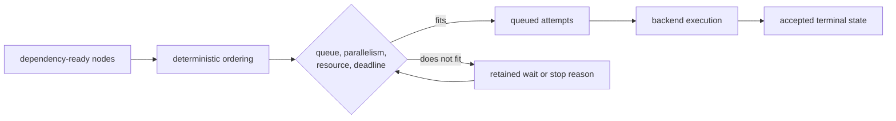

# Execution Model

DAG execution converts a validated graph into two inseparable results: node
outcomes and retained evidence explaining how those outcomes were accepted.
The controller remains authoritative from planning through finalization.
Workers, container engines, and batch schedulers report observations; they do
not write accepted run state independently.

## Ownership Across Crates

| Crate | Execution responsibility | Must not own |
| --- | --- | --- |
| `bijux-dag-cli` | process startup and final error-to-exit mapping | graph, scheduling, or artifact semantics |
| `bijux-dag-app` | command orchestration, runtime configuration, backend selection, and typed response rendering | runtime engine internals |
| `bijux-dag-core` | graph parsing, validation, canonical identity, and executable planning | subprocesses or retained run mutation |
| `bijux-dag-runtime` | admission, scheduling, adapter invocation, retry, cache, policy, lifecycle acceptance, and persistence orchestration | command presentation |
| `bijux-dag-artifacts` | run-directory models, integrity, indexes, lineage, markers, and durable storage helpers | scheduling decisions |

This split prevents the command layer from inventing execution semantics and
prevents a backend result from bypassing controller validation.

## Admission Before Effects

Execution begins only after the following facts are established:

1. The graph parses against the supported specification.
2. Node IDs, edges, ports, inputs, outputs, branches, triggers, resources,
   effects, retries, and cache declarations validate.
3. Canonical graph identity is computed.
4. Selectors and dependency closure lower the graph into an execution plan.
5. Planner, execution, and evidence fingerprints are computed from their
   distinct inputs.
6. Runtime policy and backend configuration are resolved.
7. Required adapter or backend capabilities and authorized output paths pass
   preflight.

The plan records planned nodes and dependencies, ordering, branch analysis,
filter reasons, diagnostics, and identity. It is not a queue snapshot.
Scheduling decisions still depend on accepted runtime state, resource
availability, trigger rules, cancellation, and deadlines.

Before a node launches, the runtime creates a staging run directory and writes
the graph snapshot, initial manifest, provenance, policy, adapter inventory,
selected inputs, cache configuration, and run identity. If setup cannot
establish that evidence boundary, execution fails rather than running without
a record.

## Scheduler Authority

The scheduler derives a ready frontier from dependency counts and accepted
terminal states. A node can advance only when:

- its dependencies satisfy its trigger rule;
- selectors and branch decisions keep it in the execution path;
- its resource request fits configured CPU, memory, GPU, named-resource, queue,
  and worker-capacity limits;
- the run has not stopped admitting work because of fail-fast, cancellation,
  or deadline policy.

`ready` and `queued` are distinct lifecycle states. Ready means dependency and
selection conditions are satisfied. Queued means the scheduler admitted the
node into the bounded execution queue. Only backend launch moves it to
`running`.

Concurrency changes completion order, not state ownership. Worker completion
must return through the engine, pass terminal-transition validation, and
produce retained trace evidence before dependants can use it.

## Bounded Load Semantics

The scheduler admits work through intersecting limits instead of treating
`--jobs` as an unconditional thread count:

| Limit | Decision it controls | Evidence when work waits |
| --- | --- | --- |
| maximum parallelism and `jobs` | upper bound on simultaneously admitted local work | ready or queued state plus scheduler decision |
| bounded executor capacity | number of attempts allowed into the execution queue | queue admission refusal or wait |
| CPU and memory budgets | aggregate declared demand of admitted nodes | resource-specific blocked reason |
| GPU and named-resource budgets | availability of exclusive or counted capabilities | resource-specific blocked reason and inventory |
| per-node timeout | maximum accepted duration for one attempt | timed-out attempt and lifecycle trace |
| run timeout | admission and completion behavior for the entire run | run timeout event and configured behavior |
| fail-fast or cancellation | whether new work may enter after a stop condition | causal event and visible terminal consequences |



These controls provide bounded execution within one controller. They do not
establish cluster-wide admission, fairness between independent controllers,
autoscaling, or service-level capacity. Performance and scale claims require a
named scenario, configuration, backend, workload, and retained measurement.

## Node Execution Contract

For an admitted executable node, the governed order is:

```text
materialize declared inputs
  -> compute and verify cache proof
  -> execute under retry policy when no valid hit exists
  -> validate terminal lifecycle transition
  -> retain trace and attempt evidence
  -> publish eligible cache evidence
```

The engine routes those operations through
`runtime_core/governance/sacred_execution.rs`. This gives cache lookup, retry,
trace writing, cache publication, dependency resolution, and node counting one
reviewable path.

- A cache hit still receives a node trace and accepted `cached` lifecycle.
- Every retry retains attempt status, backoff decision, stdout, and stderr.
- A failed attempt does not overwrite earlier attempt evidence.
- Trace persistence failure is an execution failure, not optional telemetry
  loss.
- Cache publication follows accepted execution and trace handling; it cannot
  make an incomplete result reusable.
- Undeclared or missing outputs fail finalization for the node.

The accepted terminal states are `succeeded`, `failed`, `skipped`, `cached`,
`cancelled`, and `timed_out`. The retained trace also records the validated
lifecycle path that reached that status.

## Backend Boundary

| Backend surface | Current execution contract | Explicit limit |
| --- | --- | --- |
| local shell | host process with declared-effect policy, environment shaping, timeout, stream capture, and output validation | not a host sandbox |
| local container | Docker or Podman process with validated mounts, optional no-network enforcement, image policy, and output validation | isolation is no stronger than the selected engine |
| Kubernetes | container node submitted as a Job against a configured shared workspace | not a general workflow controller; no controller restart recovery promise |
| SLURM | job submitted with `sbatch`, observed through `sacct`, and reconciled through a shared run directory | not a generic HPC abstraction; shared filesystem is required |
| fake batch | deterministic backend lifecycle used for contract proof | no external scheduler is contacted |
| remote worker and distributed coordination | typed payload, lease, heartbeat, event, and reconciliation models | not a stable operator service |

Every implemented backend reports capabilities and follows prepare, launch,
observe, finalize, and cleanup boundaries. Capability mismatch fails before
work is accepted. Backend status, logs, scheduler IDs, and provisional outputs
remain observations until the controller validates and commits the result.

See [Execution Modes and Coordination Boundaries](execution-mode-responsibilities.md)
for deployment prerequisites and maturity. Repository models of remote or
distributed behavior are not evidence that those services ship.

## Run Stop Semantics

Node failure, operator interruption, and run timeout are different terminal
causes:

- ordinary node failure can trigger fail-fast admission stop while preserving
  accepted terminal evidence for the remaining graph;
- cancellation records `cancelled` run status and an operator request or
  interrupt cause;
- timeout records `timed_out` and either stops new launches while letting
  running nodes finish or caps running work to the remaining deadline,
  according to `finish_running` or `cancel_running`.

Already accepted node outcomes remain intact. Work that never becomes
executable is classified through the relevant skip, cancel, or failure
propagation path rather than disappearing from counts.

## Finalization And Evidence Completeness

At finalization the engine:

1. derives node counts from the accepted status map and verifies them against
   trace statuses;
2. sets run status to `success`, `failed`, `cancelled`, or `timed_out`;
3. writes output indexes, lineage, timeline, metrics, audit, root-cause, and
   failure-propagation evidence;
4. writes the run schema index and finalized manifest;
5. writes a complete or incomplete marker;
6. renames the staging directory to its final run path;
7. updates the optional latest-run link only after successful finalization.

Evidence completeness and run success are not synonyms. A failed or cancelled
run can be completely finalized and carry `.run-complete.json`. A timed-out
run retains `.run-incomplete.json` so partial output cannot be presented as
complete proof. The manifest status remains the run outcome; the marker states
whether finalization completed under its evidence contract.

Replay, diff, inspect, and cache verification consume retained files. They do
not reconstruct authority from console text, backend events, or an output
directory that lacks required integrity.

## Failure Ownership

| Failure point | Owning response |
| --- | --- |
| parse, graph validation, or canonical identity | correct graph input or core contract |
| selector, planning, or fingerprint | correct planner inputs and plan contract |
| policy or capability admission | correct declared effects, runtime policy, or selected backend |
| materialization or cache verification | refuse reuse and inspect retained input or cache proof |
| adapter execution | retain attempt evidence and classify backend failure |
| terminal transition | reject the backend result and repair lifecycle handling |
| trace, index, lineage, or marker write | treat the run as evidence failure, not successful execution |
| replay or diff refusal | repair or restore retained evidence; do not infer missing facts |

Recovery starts from the retained run directory and its manifest, markers,
traces, indexes, and audit stream. Rerunning a graph creates new evidence; it
does not repair or replace the historical result.

## Security And Reproducibility Limits

Policy validates declared effects and owned paths. Shell execution remains a
host process; replay sandboxing protects source evidence from writes but does
not sandbox the replayed process. Cache and replay identity cover declared
inputs, environment, adapter, backend, policy, and artifact hashes, not
undeclared ambient state or external business effects.

Use [Execution Security and Isolation](../operations/security-isolation-truth.md)
before running untrusted work and [Reproducibility Model](../interfaces/reproducibility-model.md)
before claiming two runs are equivalent.

## Execution Invariants

- No executable node launches before graph, plan, policy, and output-path
  admission.
- Backend completion cannot advance dependencies before controller acceptance.
- Cached, skipped, failed, cancelled, and timed-out nodes remain visible.
- Retry and cache behavior preserve attempt and identity evidence.
- Manifest counts derive from accepted node state, not backend summaries.
- Run finalization failure cannot be reported as successful retained evidence.
- Implemented batch lanes do not imply a remote-worker or distributed
  control-plane promise.

## Verification Anchors

- `crates/bijux-dag-core/src/pipeline/parse.rs`
- `crates/bijux-dag-core/src/planner/planner.rs`
- `crates/bijux-dag-runtime/src/runtime_core/execution/scheduler.rs`
- `crates/bijux-dag-runtime/src/runtime_core/execution/engine.rs`
- `crates/bijux-dag-runtime/src/runtime_core/governance/sacred_execution.rs`
- `crates/bijux-dag-runtime/src/backend/runtime/`
- `crates/bijux-dag-artifacts/src/lib.rs`
- `crates/bijux-dag-runtime/tests/sacred_execution_flow_contracts.rs`
- `crates/bijux-dev/tests/sacred_execution_hardening_contracts.rs`

## Related Architecture

- [Runtime Execution Flow](runtime-execution-flow.md)
- [State and Persistence](state-and-persistence.md)
- [Execution Modes and Coordination Boundaries](execution-mode-responsibilities.md)
- [Run Evidence Layout](../interfaces/run-evidence-layout.md)
- [Failure Recovery](../operations/failure-recovery.md)
