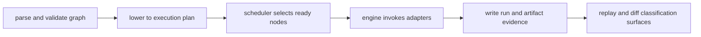

# Execution Model

DAG execution converts validated graph semantics into node outcomes and artifact
evidence under explicit scheduler and policy controls.

## Visual Summary

## Execution Stages

1. parse, validate, canonicalize graph input
2. lower to runtime execution plan
3. scheduler computes dependency-correct frontier
4. engine executes nodes through adapter boundaries
5. runtime writes node traces and run outputs
6. replay/diff services consume persisted evidence

## Code Anchors

- `crates/bijux-dag-core/src/pipeline/parse.rs`
- `crates/bijux-dag-core/src/planner/planner.rs`
- `crates/bijux-dag-runtime/src/runtime_core/execution/scheduler.rs`
- `crates/bijux-dag-runtime/src/runtime_core/execution/engine.rs`
- `crates/bijux-dag-artifacts/src/lib.rs`

## Next Reads

- [State and Persistence](state-and-persistence.md)
- [Operator Workflows](../interfaces/operator-workflows.md)
- [Failure Recovery](../operations/failure-recovery.md)
