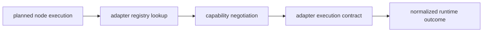

# Extensibility Model

DAG extensibility centers on adapter boundaries and capability negotiation, not
on unrestricted runtime mutation.

## Visual Summary

## Extensibility Surfaces

- adapter SDK and plugin contract descriptors
- backend capability descriptors and negotiation policies
- extension catalog and compatibility issue detection
- simulated-platform quarantined surfaces for non-stable experiments

## Code Anchors

- `crates/bijux-dag-runtime/src/adapters/sdk.rs`
- `crates/bijux-dag-runtime/src/adapters/registry.rs`
- `crates/bijux-dag-runtime/src/backend/capability.rs`
- `crates/bijux-dag-runtime/src/internal/ext/extension_catalog.rs`
- `crates/bijux-dag-runtime/src/simulated_platform.rs`

## Extensibility Constraints

- extensions must not bypass core semantic contracts
- capability downgrade must remain explicit and observable
- unstable platform simulations must stay out of stable root behavior

The modeled platform surfaces called out here stay under `LIM-006` until they
gain real release-grade runtime semantics.

## Next Reads

- [Artifact Contracts](../interfaces/artifact-contracts.md)
- [Execution Security And Isolation](../operations/security-isolation-truth.md)
- [Known Limitations](../quality/known-limitations.md)
