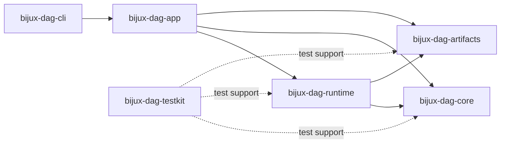

# DAG Architecture

The DAG stack separates semantic truth, execution, retained evidence,
orchestration, and process presentation. That split lets a graph keep the same
meaning across execution modes while making backend limits and evidence quality
explicit.

## Ownership And Direction

| Owner | Decides | Must not decide |
| --- | --- | --- |
| `bijux-dag-core` | graph model, validation, canonical identity, domain errors, and planning inputs | process execution, storage, or CLI rendering |
| `bijux-dag-runtime` | planning, scheduling, backends, execution state, cache/replay inputs, and runtime diagnostics | graph schema meaning or command presentation |
| `bijux-dag-artifacts` | run-directory types, manifests, integrity, artifact IO, and retention mechanics | scheduler outcomes or route policy |
| `bijux-dag-app` | command routes, use-case composition, response payloads, and operator workflows | lower-layer semantic reinvention |
| `bijux-dag-cli` | argument decoding, stream writing, and process exit | application or runtime behavior |
| `bijux-dag-testkit` | reusable fixtures and consumer-facing test support | production behavior |

## Route A Change

| Change | Architecture authority | First proof boundary |
| --- | --- | --- |
| graph field, validation, or fingerprint | [Module Map](module-map.md) and [Dependency Direction](dependency-direction.md) | graph identity and fingerprint contracts |
| scheduler, node execution, or state transition | [Execution Model](execution-model.md), [Runtime Execution Flow](runtime-execution-flow.md), and [Runtime Concurrency Boundaries](runtime-concurrency-boundaries.md) | scheduler determinism, execution, and state-machine contracts |
| shell, container, batch, or modeled backend | [Engine Backend Responsibilities](engine-backend-responsibilities.md) and [Execution Modes and Coordination Boundaries](execution-mode-responsibilities.md) | backend capability and execution-mode contracts |
| run manifest, artifact, import/export, or integrity | [State and Persistence](state-and-persistence.md) and [Storage Layout Ownership](storage-layout-ownership.md) | artifact conformance, resilience, lineage, and hardening contracts |
| replay, diff, inspect, or response envelope | [Integration Seams](integration-seams.md) and [Error Model](error-model.md) | application route and semantic replay contracts |
| public command or process behavior | [Code Navigation](code-navigation.md) | generated CLI reference and binary/application parity |

## Cross-Layer Invariants

- Graph identity is independent of the operator's working directory and other
  ambient repository state.
- Runtime state transitions cannot make incomplete work appear complete.
- Artifact integrity and lineage are verified before replay or comparison
  claims are accepted.
- Backend capability is explicit; unsupported behavior fails or reports a
  bounded model rather than silently degrading.
- Application routes preserve lower-layer reason codes and unknown or
  incomplete states.
- The executable remains a thin process boundary over application behavior.

## Stable Versus Modeled Surfaces

Architecture presence is not release support. A backend type, simulation route,
or coordination model can exist for contract development without belonging to
the stable default command surface. The
[Release Boundary](../foundation/release-boundary.md),
[Support Matrix](../interfaces/support-matrix.md), and
[Known Limitations](../quality/known-limitations.md) decide what operators can
rely on in the current release.

Use [Architecture Risks](architecture-risks.md) when a change can weaken
identity, state, integrity, backend honesty, or replay conclusions. Use the
[Command Surface](../interfaces/cli-surface.md) for caller-visible behavior.
