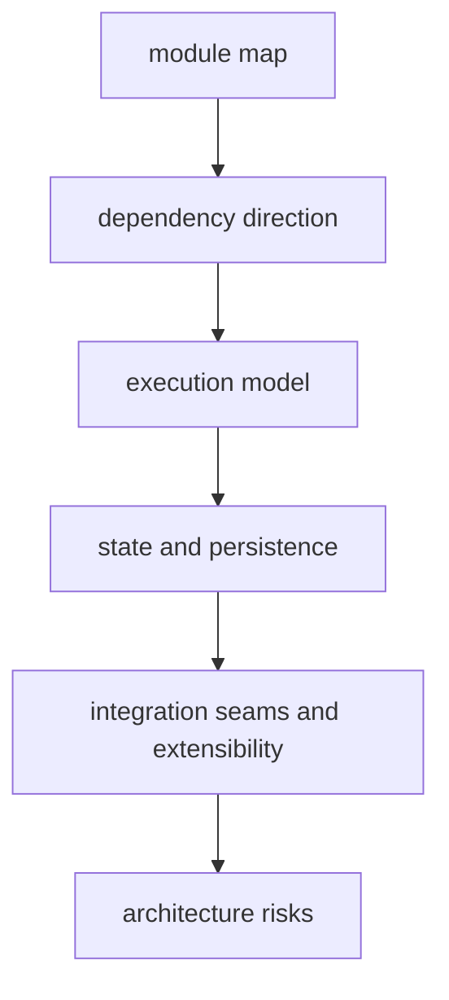

# DAG Architecture

The architecture section explains how DAG behavior is implemented across crates:
semantic kernel, runtime engine, artifact persistence, and orchestration routes.

## Visual Summary

## Architecture Scope

- crate/module responsibilities
- dependency direction guardrails
- engine scheduling and execution flows
- persistence and lineage touchpoints
- seam and risk analysis for replay/diff trust

## Code Anchors

- `crates/bijux-dag-core/src/`
- `crates/bijux-dag-runtime/src/`
- `crates/bijux-dag-artifacts/src/`
- `crates/bijux-dag-app/src/`

## Pages In This Section

- [Module Map](module-map.md)
- [Dependency Direction](dependency-direction.md)
- [Execution Model](execution-model.md)
- [State and Persistence](state-and-persistence.md)
- [Integration Seams](integration-seams.md)
- [Error Model](error-model.md)
- [Extensibility Model](extensibility-model.md)
- [Code Navigation](code-navigation.md)
- [Architecture Risks](architecture-risks.md)
