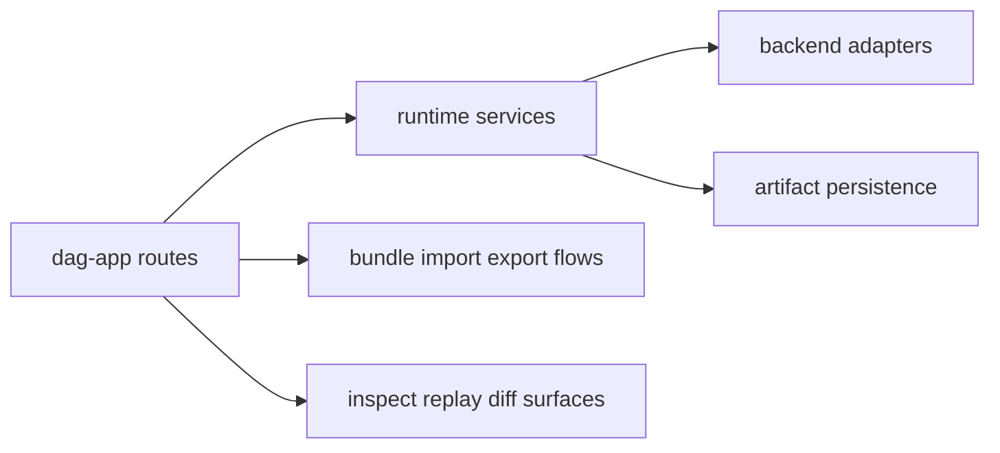

# Integration Seams

Integration seams are where DAG behavior crosses boundaries: adapter invocation,
bundle import/export, backend capability checks, and inspect/replay/diff service
consumption.

## Visual Summary

## Key Seams

- app route handlers to runtime execution services
- runtime engine to adapter contracts (`local`, `container`, `external`)
- runtime to artifact storage and integrity services
- import/export bundle flows and verification checks
- capability-bound replay/diff classification paths

## Code Anchors

- `crates/bijux-dag-app/src/routes/`
- `crates/bijux-dag-runtime/src/adapters/`
- `crates/bijux-dag-runtime/src/backend/`
- `crates/bijux-dag-artifacts/src/storage/services.rs`
- `crates/bijux-dag-app/src/commands/export_cmd.rs`

## Seam Rules

- inputs crossing seams must be validated and typed
- downgrade or incomplete states must be explicit in output
- seam failures must preserve inspectable error context

## Next Reads

- [Extensibility Model](extensibility-model.md)
- [Deployment Boundaries](../operations/deployment-boundaries.md)
- [Trust Boundaries](../operations/trust-boundaries.md)
- [Risk Register](../quality/risk-register.md)
