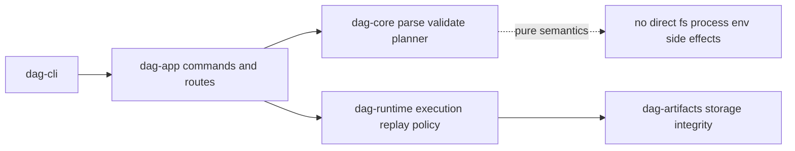

# Module Map

DAG modules are split by semantic responsibility to keep validation, execution,
and persistence behavior auditable.

## Visual Summary

## Module Families

- core: graph model, canonicalization, validation, planner lowering
- runtime: scheduler, execution engine, replay, policy, observability
- artifacts: run/artifact models, hardening, lineage, storage services
- app: CLI orchestration, route handlers, output contract rendering
- cli: binary entrypoint and completion generation

## Code Anchors

- `crates/bijux-dag-core/src/graph/`
- `crates/bijux-dag-runtime/src/runtime_core/`
- `crates/bijux-dag-artifacts/src/storage/`
- `crates/bijux-dag-app/src/routes/`
- `crates/bijux-dag-cli/src/main.rs`

## Next Reads

- [Dependency Direction](dependency-direction.md)
- [Code Navigation](code-navigation.md)
- [Public Imports](../interfaces/public-imports.md)
