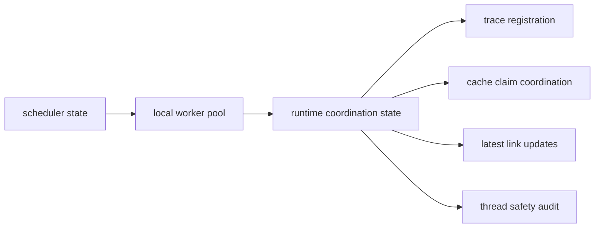

# Runtime Concurrency Boundaries

`bijux-dag` uses concurrency to overlap safe local work, not to weaken runtime
ownership boundaries.

## Boundary map

## What may happen concurrently

- local worker assignments may run in parallel up to the configured worker capacity
- worker completions may arrive out of submission order
- predecessor completions may arrive in parallel
- trace writes may be registered from multiple worker threads
- cache-claim attempts may race on the same fingerprint
- latest-link updates may be emitted by competing completion paths

## What must remain serialized by invariant

- scheduler decisions must respect the configured local worker capacity
- downstream readiness may only be unlocked once per dependency truth
- one cache claimant must win per fingerprint
- summary counters and trace indices must describe the same completed work
- run-state verification must reject reads that overlap an active run

## Code anchors

- `crates/bijux-dag-runtime/src/runtime_core/execution/run_state.rs`
- `crates/bijux-dag-runtime/tests/concurrency_contracts.rs`
- `crates/bijux-dag-runtime/src/runtime_core/execution/scheduler.rs`
- `crates/bijux-dag-runtime/src/backend/runtime/local_worker_pool.rs`

## Next reads

- [Concurrency Model](../../../spec/CONCURRENCY_MODEL.md)
- [Execution Model](../execution-model.md)
- [State and Persistence](../state-and-persistence.md)
