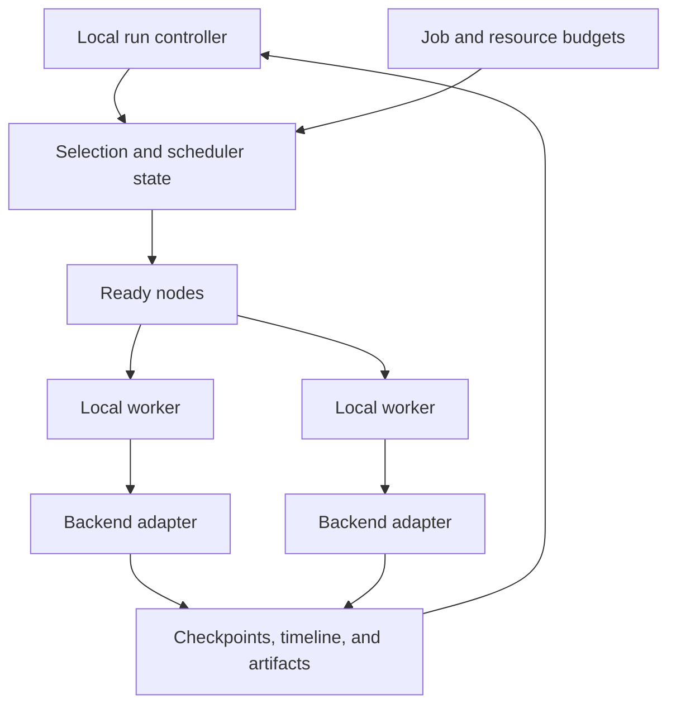

# Runtime Concurrency Boundaries

This page names the concurrency boundaries that `bijux-dag` currently
implements so operators and maintainers do not infer a broader scheduler or
replication model than the runtime actually proves.

## Core Boundary

The stable runtime is a local, single-controller execution engine.

- one controlling process owns selection, queueing, scheduler state, and node
  status transitions for a run
- parallel node execution may occur within the run, but that parallelism is
  coordinated by the same local controller boundary
- retained run evidence is the recovery boundary; there is no replicated
  control plane or multi-controller lease protocol in the stable surface

Workers may overlap in wall-clock time. They do not independently own run
state, resource allocation, or terminal node transitions.

## Implemented Concurrency Surfaces

- worker pools, job budgets, and named resource capacities govern local
  parallel execution within one run
- scheduler checkpoints, timeline evidence, and run snapshots persist the
  decisions needed to inspect concurrent execution after the fact
- replay, diff, and cache verification treat retained evidence as the source of
  truth instead of relying on ambient process state

## Ownership And Synchronization

| Concern | Owner | Required invariant |
| --- | --- | --- |
| runnable-node selection | scheduler under the run controller | dependencies are terminal and selection is deterministic for equivalent state |
| job and named-resource admission | controller resource accounting | admitted work never exceeds the configured capacity |
| backend process or task execution | selected adapter | completion is reported once through the runtime boundary |
| retry and timeout decisions | runtime execution policy | attempts and terminal reason remain represented in retained evidence |
| node status transition | controller-owned state | transitions follow the governed lifecycle and cannot regress from terminal state |
| checkpoint and timeline persistence | runtime-to-artifact boundary | evidence describes the decision that was committed |

Shared mutable state must stay behind the controller boundary. An adapter can
perform concurrent work, but it returns observations rather than mutating the
run model or writing an alternate scheduler history.

## Failure And Recovery Rules

- A worker panic, timeout, cancellation, or backend failure becomes an explicit
  attempt outcome; it cannot disappear because another node succeeded.
- Capacity is released on every terminal path, including refusal and
  cancellation.
- Checkpoint recovery uses retained run evidence and validates compatibility
  before resuming.
- Cancellation stops new admissions before completion is reported.
- Partial artifact writes must not be presented as committed run evidence.
- Replaying retained evidence does not reassign historical scheduler
  decisions to the current process.

Concurrency tests should force overlap and contention. A test that happens to
run with multiple threads but never proves admission, ordering, or terminal
state does not establish these contracts.

## Excluded Concurrency Claims

This repository does not currently claim:

- multi-controller failover
- distributed queue ownership
- remote worker lease coordination as a stable operator surface
- cluster-wide scheduler consensus

Terms such as "worker", "queue", and "checkpoint" are local runtime terms in
this repository. They do not imply distributed durability or failover.

For the contract language behind these limits, use
[Known Limitations](../quality/known-limitations.md) and
[Concurrency Model](../../spec/CONCURRENCY_MODEL.md).
