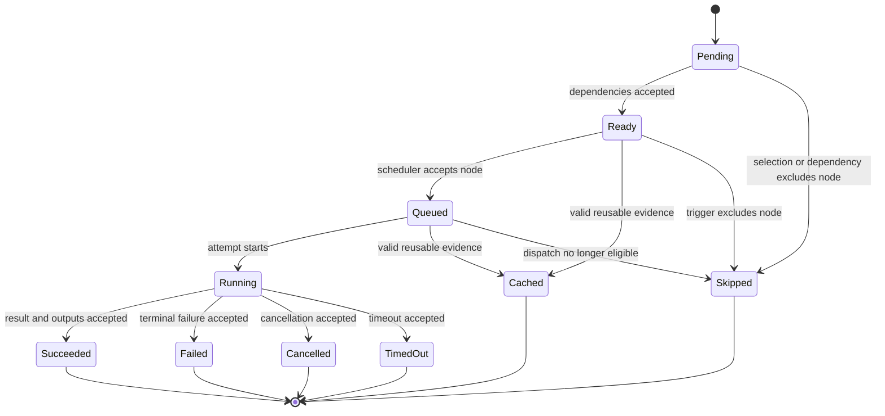

# Runtime Execution Flow

The runtime engine owns the ordered path from an execution plan to retained
node and run evidence. It delegates implementation details through a governed
hook layer so cache, retry, trace, and dependency behavior cannot quietly
diverge across execution routes.

## Run-Level Flow

1. Build the dependency counter and ready queue from the execution plan.
2. Evaluate dependency readiness, trigger rules, and cancellation state.
3. Dispatch ready work through the configured execution route.
4. Validate each terminal node transition before accepting its status.
5. Advance dependants only from accepted terminal state.
6. Derive run counts and write retained run summaries from the final status
   map.

Concurrency changes when work can finish, not who owns acceptance. Worker or
backend completion must return through the engine before it can change
dependency readiness or durable run state.



The retained vocabulary is contract-owned by the implementation and schemas;
this diagram shows the central execution path and representative early
terminal transitions. Cancellation and timeout are also valid before running.
Retry policy creates governed attempts; it does not reverse a terminal
lifecycle transition.

## Node-Level Flow

For an executable node, the engine orders:

```text
materialize inputs
    -> compute and inspect cache proof
    -> execute with retry policy when no valid hit exists
    -> validate terminal transition
    -> write trace evidence
    -> publish eligible cache evidence
```

A cache hit still produces governed node evidence; it is not an unrecorded
shortcut. A failed attempt still reaches trace writing with structured failure
information. Cache publication follows accepted execution and trace handling
so an incomplete result cannot become reusable proof.

## Dependency Consequences

| Accepted node outcome | Scheduler consequence | Retained consequence |
| --- | --- | --- |
| succeeded | dependants may become ready when their remaining conditions pass | successful attempt, output, and cache eligibility evidence |
| failed | retry or terminal dependency consequences follow owned policy | every attempt and the terminal failure remain attributable |
| cancelled | no new work is inferred from the cancelled node | cancellation and cleanup outcome remain visible |
| skipped | trigger-aware dependants are re-evaluated | skip reason remains distinct from success |
| dependency-blocked skip | dependent work that cannot become eligible stays unexecuted | skip status and causal dependency result remain inspectable |
| valid cache hit | node is accepted without a new execution attempt | lookup decision and reused identity are recorded |
| invalid cache candidate | execution continues as a miss or fails under policy | rejection reason is preserved; candidate is not proof |

Dependency advancement consumes accepted state, never raw worker completion.
This prevents a late event, malformed result, or invalid transition from
unlocking downstream work.

## Sacred Boundary

The engine routes shared execution operations through
`crates/bijux-dag-runtime/src/runtime_core/governance/sacred_execution.rs`
instead of calling lower-level cache, trace, materialization, retry, or
dependency helpers directly.

| Hook | Governed responsibility |
| --- | --- |
| `resolve_dependencies` | construct dependency state from the execution plan |
| `run_materialize_inputs` | produce the declared input index for an attempt |
| `run_cache_lookup` | evaluate reusable evidence under the active runtime and adapter identity |
| `run_retry_logic` | apply the configured attempt policy through the adapter |
| `guard_terminal_node_status` | refuse invalid terminal lifecycle transitions |
| `run_write_trace` | retain status, failure, output, cache, adapter, and lifecycle evidence |
| `run_cache_write` | publish eligible execution evidence to the cache |
| `count_terminal_nodes` | derive manifest counts from accepted state |

These wrappers are intentionally thin. Their value is one reviewable call path:
tests and maintainers can detect a new route that bypasses the established
execution contract.

## Failure and Recovery Rules

- Input or cache failures stop that node route before execution.
- Retry policy owns repeated attempts; the scheduler does not invent an
  independent retry loop.
- Terminal-state validation precedes dependency advancement.
- Trace failures are runtime failures because retained evidence is part of the
  result, not optional telemetry.
- Cache-write eligibility cannot change the already accepted node outcome.
- Recovery and inspection use retained run state rather than reconstructing
  authority from worker events.

## Code and Contract Map

- engine orchestration:
  `crates/bijux-dag-runtime/src/runtime_core/execution/engine.rs`
- governed hooks:
  `crates/bijux-dag-runtime/src/runtime_core/governance/sacred_execution.rs`
- contract: `docs/spec/SACRED_EXECUTION_FLOW.md`
- runtime proof:
  `crates/bijux-dag-runtime/tests/sacred_execution_flow_contracts.rs`
- maintainer bypass guard:
  `crates/bijux-dev/tests/sacred_execution_hardening_contracts.rs`

Changing execution order or introducing another execution route requires the
engine, sacred hooks, contract, and both proof suites to change together.
