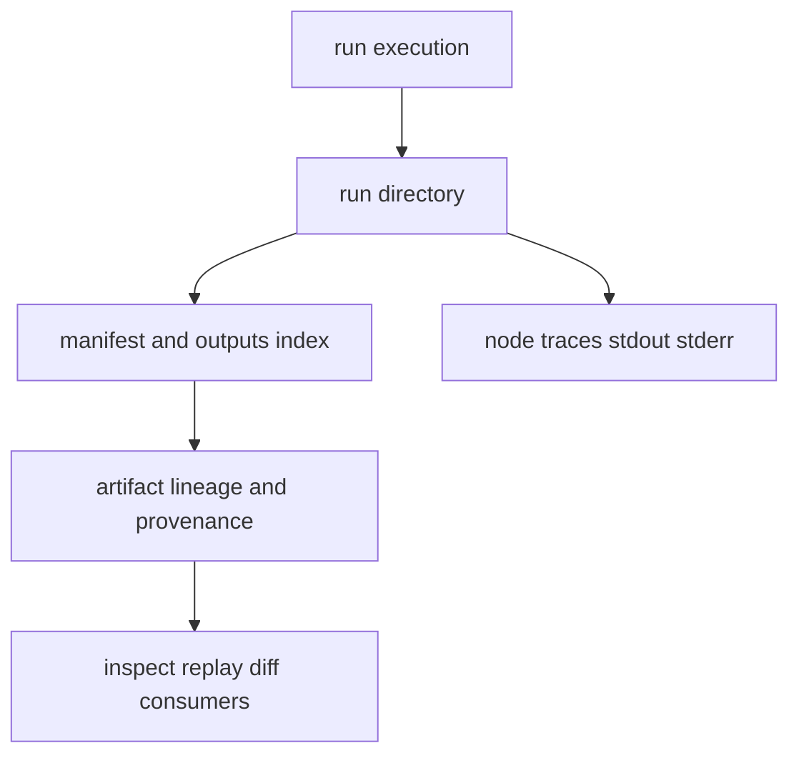

# State and Persistence

Persistence in DAG is not incidental. Run directories, node traces, artifact
indices, and lineage links are the evidence substrate for inspect/replay/diff.

## Visual Summary

## Persisted Surfaces

- run manifest and run metadata
- node-level outputs, logs, and traces
- outputs/input index files
- artifact integrity and provenance records
- replay and diff proof-relevant metadata

## Code Anchors

- `crates/bijux-dag-artifacts/src/storage/models.rs`
- `crates/bijux-dag-artifacts/src/storage/hardening.rs`
- `crates/bijux-dag-artifacts/src/lifecycle/lineage.rs`
- `crates/bijux-dag-runtime/src/artifacts/`
- `crates/bijux-dag-app/src/inspect/run_views.rs`

## Next Reads

- [Artifact Contracts](../interfaces/artifact-contracts.md)
- [Observability and Diagnostics](../operations/observability-and-diagnostics.md)
- [Known Limitations](../quality/known-limitations.md)
