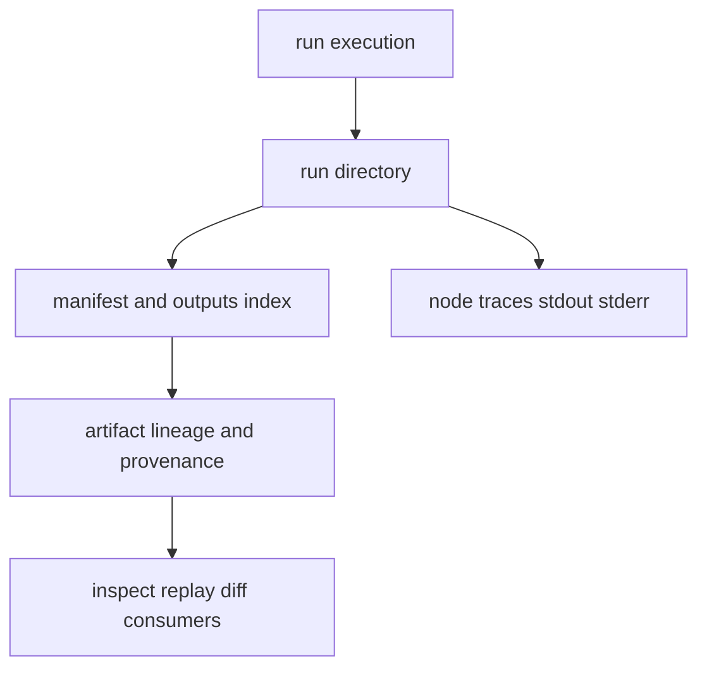

# State and Persistence

Persistence in DAG is not incidental. Run directories, node traces, artifact
indices, and lineage links are the evidence substrate for inspect/replay/diff.

## Visual Summary

## Persisted Surfaces

- run manifest and run metadata
- node-level outputs, logs, and traces
- outputs/input index files
- artifact integrity and provenance records
- replay and diff proof-relevant metadata

## Node Trace Lifecycle Evidence

Each persisted `trace.json` now carries two lifecycle-specific fields in
addition to the coarse terminal `status`.

- `lifecycle_state` records the final runtime state that best matches what
  actually happened to the node.
- `lifecycle_transitions` records the validated state path the runtime observed
  while scheduling or executing that node.

This separation matters because terminal status alone is not always honest
enough. A node can end with status `failed` while its lifecycle state is
`timed_out` or `cancelled`, and a cached node should never claim that execution
started just because it was scheduled for cache lookup.

The persisted lifecycle states are:

- `pending`
- `eligible`
- `queued`
- `running`
- `success`
- `failed`
- `skipped`
- `cached`
- `cancelled`
- `timed_out`

## Code Anchors

- `crates/bijux-dag-artifacts/src/storage/models.rs`
- `crates/bijux-dag-artifacts/src/storage/hardening.rs`
- `crates/bijux-dag-artifacts/src/lifecycle/lineage.rs`
- `crates/bijux-dag-runtime/src/artifacts/`
- `crates/bijux-dag-app/src/inspect/run_views.rs`

## Next Reads

- [Artifact Contracts](../interfaces/artifact-contracts.md)
- [Observability and Diagnostics](../operations/observability-and-diagnostics.md)
- [Known Limitations](../quality/known-limitations.md)
