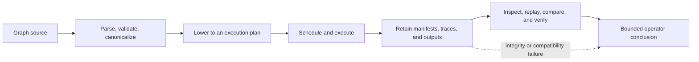

# Capability Map

Use this page when you need the reader-facing answer to a basic question: what
is `bijux-dag` actually good at today?

The higher-level split matters before crate ownership does. Most readers first
need to know whether they are dealing with graph truth, execution behavior,
retained evidence, or replay and comparison.

## What Readers Usually Come Here To Confirm

| Capability area | What you can expect |
| --- | --- |
| graph truth | parse, validate, canonicalize, fingerprint, and lower graphs deterministically |
| execution | plan, schedule, run, and classify node outcomes with explicit policy boundaries |
| retained evidence | inspect runs, artifacts, traces, and integrity material after execution completes |
| replay and comparison | decide whether two runs are equivalent, drifted, incomplete, or unknown |
| operator decision support | explain cache reuse, replay boundaries, and first divergence with retained proof |

## Core Capability Inventory

| Capability | What it covers | Primary owning crates |
| --- | --- | --- |
| definition truth | parsing, validation, canonicalization, topology, semantic identity, planner lowering | `bijux-dag-core` |
| execution | run planning, node scheduling, adapter boundaries, policy evaluation, runtime diagnostics | `bijux-dag-runtime` |
| operator workflows | command orchestration, response shaping, inspect routes, replay UX, diff UX | `bijux-dag-app`, `bijux-dag-cli` |
| evidence | run manifests, output indexes, trace files, integrity proofs, lifecycle helpers | `bijux-dag-artifacts`, `bijux-dag-runtime` |
| attribution | replay outcomes, run comparison, first-divergence reporting, cache and rerun explanations | `bijux-dag-runtime`, `bijux-dag-app` |

## Capability Lifecycle

Every later conclusion depends on the earlier authority. Execution cannot make
an invalid graph valid. A successful process cannot make incomplete artifacts
authoritative. Replay and comparison cannot infer equality when identity,
integrity, or compatibility evidence is missing.

## Stable Operator Outcomes

The public `bijux-dag` surface is built around a small number of operator
questions:

- is this graph valid and what will execute
- what happened during this run
- can this run be replayed faithfully
- what changed between two runs or two graph versions
- which artifact or node proves that conclusion

The handbook pages under [Interfaces](../interfaces/index.md) and
[Operations](../operations/index.md) are organized around those questions.

## Current Execution Boundary

| Lane | Current statement | Evidence required for a claim |
| --- | --- | --- |
| local host and container | stable operator surface for declared local nodes and supported container engines | accepted attempt records, declared outputs, retained streams, and run integrity |
| Kubernetes Job | stable bounded submission lane for container nodes using `kubectl` and a shared persistent volume claim | backend identity, submitted workload, shared storage assumptions, status, logs, and cleanup outcome |
| shared-filesystem SLURM | stable bounded submission lane through `sbatch` and `sacct` | submission identity, shared path assumptions, scheduler status, output collection, and cleanup outcome |
| generic HPC or remote workers | unreleased | no stable product claim; shared types or modeled reports do not promote the lane |
| simulated control-plane namespaces | modeled and opt-in | simulation evidence only, never production equivalence |

Stable means the bounded lane is part of the current release contract. It does
not mean all clusters, engines, security policies, storage classes, or failure
modes are equivalent.

## What This Map Is Not Saying

- It is not claiming universal backend equivalence.
- It is not claiming that simulated or internal routes belong to the default
  product story.
- It is not replacing the release-boundary and package pages when you need the
  exact lane or crate owner.

## Code Anchors

- `crates/bijux-dag-core/src/`
- `crates/bijux-dag-runtime/src/`
- `crates/bijux-dag-app/src/routes/`
- `crates/bijux-dag-artifacts/src/`
- `crates/bijux-dag-cli/src/main.rs`

## Continue Reading

- [DAG Packages](../packages/index.md)
- [Domain Language](domain-language.md)
- [Release Boundary](release-boundary.md)
- [Module Map](../architecture/module-map.md)
- [Operator Workflows](../interfaces/operator-workflows.md)
