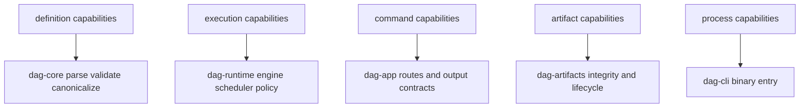

# Capability Map

This page maps DAG capabilities to concrete crate ownership so operators and
maintainers can locate responsible code quickly.

## Visual Summary

## Capability Inventory

- definition validation and canonical identity generation
- execution planning and node scheduling over DAG dependencies
- run identity and run-history inspection surfaces
- artifact lineage, integrity proofs, and portability bundle workflows
- replay and diff classification for release decisions

## Code Anchors

- `crates/bijux-dag-core/src/`
- `crates/bijux-dag-runtime/src/`
- `crates/bijux-dag-app/src/routes/`
- `crates/bijux-dag-artifacts/src/`
- `crates/bijux-dag-cli/src/main.rs`

## Next Reads

- [Domain Language](domain-language.md)
- [Module Map](../architecture/module-map.md)
- [Operator Workflows](../interfaces/operator-workflows.md)
