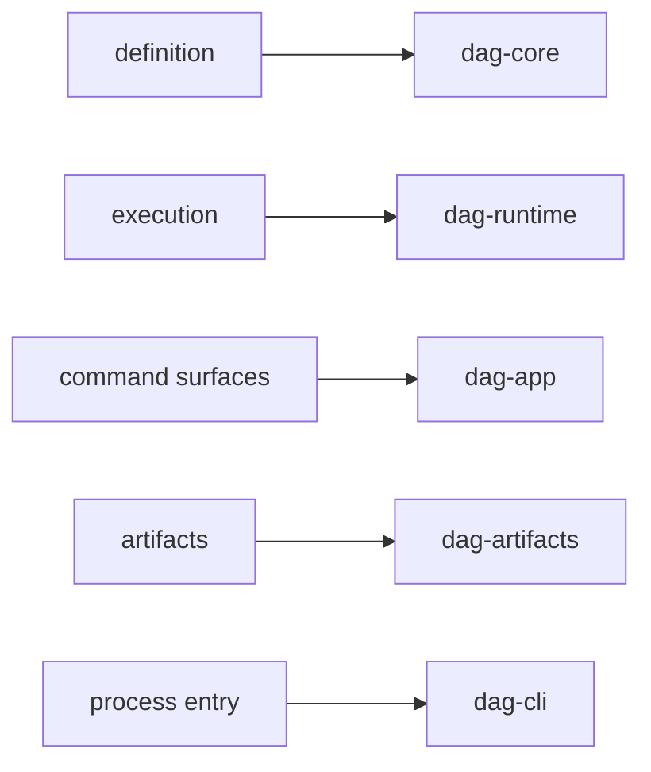

# Capability Map

This page explains what the DAG program is responsible for before it talks
about crate layout.

The capability map matters because DAG work spans definition, execution,
artifacts, and operator-facing decision support. The page should make those
responsibilities visible before a reader dives into implementation.

## Capability Map

## Capability Inventory

- definition validation and canonical identity generation
- execution planning and node scheduling over DAG dependencies
- run identity and run-history inspection surfaces
- artifact lineage, integrity proofs, and portability bundle workflows
- replay and diff classification for release decisions

## Code Anchors

- `crates/bijux-dag-core/src/`
- `crates/bijux-dag-runtime/src/`
- `crates/bijux-dag-app/src/routes/`
- `crates/bijux-dag-artifacts/src/`
- `crates/bijux-dag-cli/src/main.rs`

## Next Reads

- [Domain Language](domain-language.md)
- [Module Map](../architecture/module-map.md)
- [Operator Workflows](../interfaces/operator-workflows.md)

## Reading Rule

Use this page when the question is what the DAG program actually owns before
you decide which crate or route deserves the deeper read.
