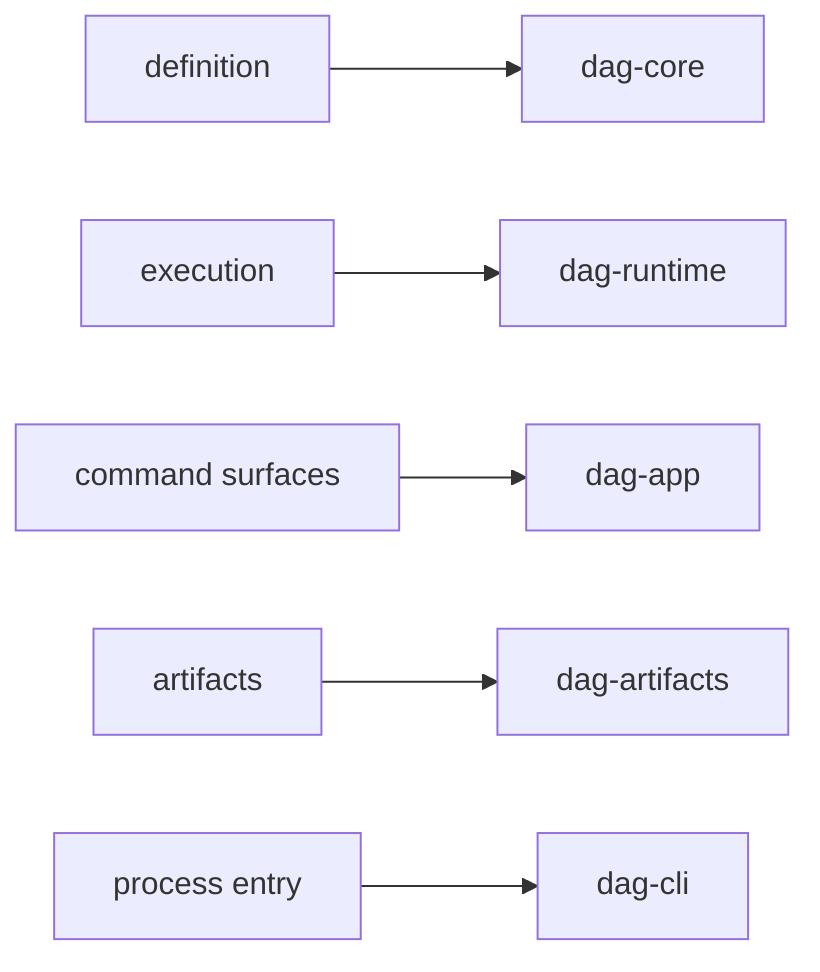

# Capability Map

This page explains what `bijux-dag` is responsible for before it talks about
crate layout.

The useful split is not only "which crate owns this?" A new reader often needs
the higher-level answer first: is the question about graph truth, execution,
replay, artifacts, or operator decision support?

## Capability Map

## Capability Inventory

| Capability | What it covers | Primary owning crates |
| --- | --- | --- |
| definition truth | parsing, validation, canonicalization, topology, semantic identity, planner lowering | `bijux-dag-core` |
| execution | run planning, node scheduling, adapter boundaries, policy evaluation, runtime diagnostics | `bijux-dag-runtime` |
| operator workflows | command orchestration, response shaping, inspect routes, replay UX, diff UX | `bijux-dag-app`, `bijux-dag-cli` |
| evidence | run manifests, output indexes, trace files, integrity proofs, lifecycle helpers | `bijux-dag-artifacts`, `bijux-dag-runtime` |
| attribution | replay outcomes, run comparison, first-divergence reporting, cache and rerun explanations | `bijux-dag-runtime`, `bijux-dag-app` |

## Stable Operator Outcomes

The public `bijux-dag` surface is built around a small number of operator
questions:

- is this graph valid and what will execute
- what happened during this run
- can this run be replayed faithfully
- what changed between two runs or two graph versions
- which artifact or node proves that conclusion

The handbook pages under [Interfaces](../interfaces/index.md) and
[Operations](../operations/index.md) are organized around those questions.

## Code Anchors

- `crates/bijux-dag-core/src/`
- `crates/bijux-dag-runtime/src/`
- `crates/bijux-dag-app/src/routes/`
- `crates/bijux-dag-artifacts/src/`
- `crates/bijux-dag-cli/src/main.rs`

## Next Reads

- [DAG Packages](../packages/index.md)
- [Domain Language](domain-language.md)
- [Module Map](../architecture/module-map.md)
- [Operator Workflows](../interfaces/operator-workflows.md)

## Reading Rule

Use this page when the question is what the DAG program actually owns before
you decide which crate or route deserves the deeper read.
