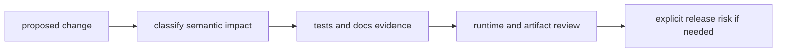

# Change Principles

This page explains the rules that keep DAG change moving without making runs,
artifacts, or replay behavior less trustworthy.

The DAG surface changes more slowly than the CLI, but when it moves, the
semantic cost is usually higher and needs to stay visible.

## Change Flow

## Principles

- determinism before convenience shortcuts
- explicit contracts before implicit behavior
- inspectability before opaque optimization
- replay/diff truthfulness before cosmetic success signals
- honest capability bounds before universal parity claims

## High-Risk Change Areas

- identity and canonicalization behavior
- replay and diff outcome classification logic
- artifact integrity and lineage persistence
- scheduler fairness and execution policy defaults

## Code Anchors

- `crates/bijux-dag-core/src/analysis/`
- `crates/bijux-dag-runtime/src/replay/`
- `crates/bijux-dag-runtime/src/runtime_core/`
- `crates/bijux-dag-artifacts/src/integrity/`

## Reading Rule

Use this page when a DAG change looks local in one crate but could alter graph
identity, replay truth, artifact lineage, or operator expectations.

## Next Reads

- [Change Validation](../quality/change-validation.md)
- [Review Checklist](../quality/review-checklist.md)
- [Release and Versioning](../operations/release-and-versioning.md)
