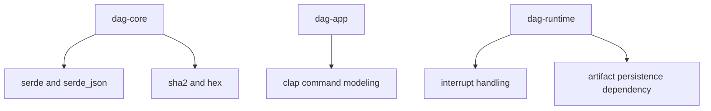

# Dependencies and Adjacencies

DAG crates rely on parsing, serialization, hashing, and command libraries, with
strict adjacency rules between semantic, runtime, and artifact layers.

## Visual Summary

## Key Dependencies

- `clap`: CLI command models and route parsing in app/cli layers
- `serde`/`serde_json`: graph/run/artifact payload serialization
- `sha2`/`hex`: identity hashing and integrity checks
- `thiserror`: typed domain and runtime error surfaces

## Adjacency Rules

- `dag-core` remains pure and side-effect free.
- `dag-runtime` may depend on `dag-core` and `dag-artifacts`.
- `dag-app` orchestrates runtime/core/artifact calls, not vice versa.
- `dag-cli` remains thin and does not absorb DAG semantics.

## Code Anchors

- `crates/bijux-dag-core/Cargo.toml`
- `crates/bijux-dag-runtime/Cargo.toml`
- `crates/bijux-dag-app/Cargo.toml`
- `crates/bijux-dag-cli/Cargo.toml`

## Next Reads

- [Dependency Direction](../architecture/dependency-direction.md)
- [Dependency Governance](../quality/dependency-governance.md)
- [Compatibility Commitments](../interfaces/compatibility-commitments.md)
