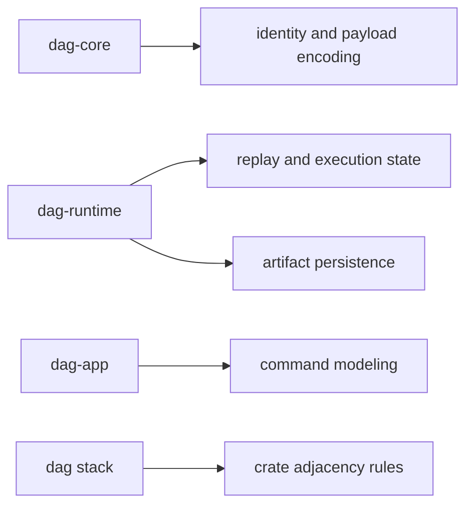

# Dependencies and Adjacencies

This page explains which dependencies shape DAG meaning and which crate
boundaries should stay explicit as the graph stack evolves.

The critical question is not dependency count. It is whether a dependency can
alter identity, replay truth, artifact integrity, or crate direction.

## Dependency Map

## Key Dependencies

- `clap`: CLI command models and route parsing in app/cli layers
- `serde`/`serde_json`: graph/run/artifact payload serialization
- `sha2`/`hex`: identity hashing and integrity checks
- `thiserror`: typed domain and runtime error surfaces

## Adjacency Rules

- `dag-core` remains pure and side-effect free.
- `dag-runtime` may depend on `dag-core` and `dag-artifacts`.
- `dag-app` orchestrates runtime/core/artifact calls, not vice versa.
- `dag-cli` remains thin and does not absorb DAG semantics.

## Code Anchors

- `crates/bijux-dag-core/Cargo.toml`
- `crates/bijux-dag-runtime/Cargo.toml`
- `crates/bijux-dag-app/Cargo.toml`
- `crates/bijux-dag-cli/Cargo.toml`

## Reading Rule

Use this page when a dependency change or a crate-to-crate shortcut seems
convenient but might blur semantic, runtime, or artifact responsibilities.

## Next Reads

- [Dependency Direction](../architecture/dependency-direction.md)
- [Dependency Governance](../quality/dependency-governance.md)
- [Compatibility Commitments](../interfaces/compatibility-commitments.md)
