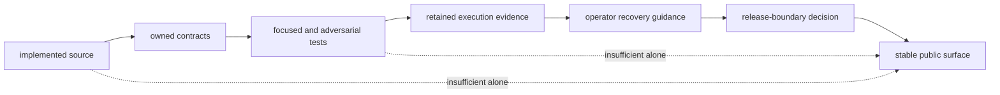

# Future Direction

`bijux-dag` currently ships as a local-first DAG runtime with explicit graph
contracts, retained execution evidence, cache explanation, replay, and
concrete container, Kubernetes Job, and shared-filesystem SLURM boundaries.
This page describes what must become true before that public promise can
widen. It does not assign dates or claim that unshipped capabilities exist.

Use [Release Boundary](release-boundary.md) for the current public contract and
[Known Limitations](../quality/known-limitations.md) for constraints in the
shipped implementation.

## Promotion Model

A capability becomes public only through the complete path. Source
reachability, a passing unit test, a simulated model, or an internal command
does not establish support by itself.

## Current Foundation

Future work must preserve the properties already required from the shipped
runtime:

- deterministic graph, plan, cache, and replay identity;
- explicit state transitions and attempt evidence;
- verifiable output hashes and lineage;
- stable refusal when a backend or policy cannot satisfy a request;
- human and machine output that report the same outcome;
- recovery guidance that does not rewrite failed history.

Growth that weakens those properties is not progress toward a wider contract.

## Graph Expressiveness

Richer branching, fan-out, joins, aggregation, and reusable graph composition
are credible additions when:

- authored semantics have strict schema and validation rules;
- canonicalization and identity account for every execution-relevant field;
- planner lowering remains deterministic;
- replay and comparison explain semantic differences;
- operator examples cover both accepted and refused graphs.

More concise authoring syntax is not sufficient if it makes identity or
failure behavior harder to inspect.

## Durable Scheduling And Backfill

The repository contains internal schedule and backfill workflows. Public
promotion requires:

- durable submission identity and idempotency;
- explicit timezone, calendar, and missed-run semantics;
- retry, exhaustion, cancellation, and overlap policy;
- retained audit records that survive controller restart;
- operator procedures for inspection, repair, and disablement;
- compatibility and release tests for the visible command surface.

Until those conditions hold, internal workflow evidence remains valuable
engineering proof but not a public scheduler service.

## Remote Workers

Remote execution changes the trust and ownership boundary. A supported worker
lane requires:

- authenticated worker identity and capability declaration;
- versioned transport and compatibility negotiation;
- defined ownership for input staging, output collection, logs, and secrets;
- heartbeat, loss, retry, cancellation, and duplicate-delivery semantics;
- cache and replay identity that records worker-relevant factors;
- recovery procedures for partial and unreachable workers.

A remote adapter prototype or modeled protocol cannot support a distributed
execution claim without this lifecycle.

## Broader Batch And Cluster Support

The current Kubernetes and SLURM lanes are intentionally concrete. Broader
support must remain backend-specific enough to expose:

- storage and path visibility assumptions;
- scheduler resource and timeout mappings;
- secret, image, module, and environment identity;
- status reconciliation and duplicate-event handling;
- log and artifact collection guarantees;
- controller restart and backend outage behavior;
- explicit unsupported and downgrade cases.

One abstract backend interface must not hide material differences between
local, Kubernetes, SLURM, or another scheduler.

## Long-Lived Compatibility

A stronger compatibility promise requires deliberate stability across:

- the visible `bijux-dag` command surface and exit behavior;
- graph schema, canonicalization, and diagnostic identities;
- retained run, trace, output, cache, and replay records;
- stable Rust modules in core, artifacts, runtime, and app crates;
- migration and refusal behavior for older evidence;
- published support and deprecation policy.

Internal and experimental exports remain outside that promise unless promoted
individually with named consumers and compatibility evidence.

## Decision Record

When a capability is proposed for public support, the change must identify:

| Decision input | Required answer |
| --- | --- |
| owner | Which crate and module own the semantics? |
| public surface | Which commands, schemas, or Rust APIs become supported? |
| refusal | What happens when requirements are unavailable or incompatible? |
| evidence | Which retained artifacts prove the behavior? |
| recovery | How does an operator inspect and repair failure? |
| compatibility | What remains stable and how are older inputs handled? |
| validation | Which focused, adversarial, integration, and release checks pass? |

If any answer is missing, the narrower release claim remains authoritative.
