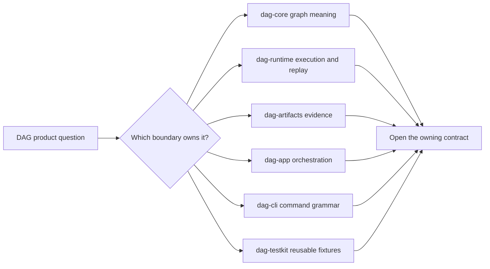

# DAG Foundation

The foundation section defines what `bijux-dag` is for, what it actually ships
today, which limits still apply, and how the DAG crate family divides
responsibility.

The package family is intentionally layered. Public convenience does not move
semantic ownership into the application or command crate.

## What This Section Covers

- what `bijux-dag` is built to solve
- what it intentionally does not claim
- responsibility boundaries across DAG crates
- how DAG crates fit inside the workspace publication boundary
- terms used for identity, replay, and diff classification
- principles for safe long-term DAG evolution

## Decide Before Changing Code

| Question | Foundation authority | Decision produced |
| --- | --- | --- |
| is this part of the stable product? | [Release Boundary](release-boundary.md) | published crate, internal crate, or non-product support |
| what does the package family own? | [Scope and Boundaries](scope-and-boundaries.md) | supported responsibility or explicit exclusion |
| which crate defines the invariant? | [Ownership Boundary](ownership-boundary.md) | one semantic owner and its consumers |
| does the capability exist today? | [Capability Map](capability-map.md) | implemented, constrained, or absent |
| which term should code and docs use? | [Domain Language](domain-language.md) | canonical vocabulary |
| where does the behavior sit in a run? | [Lifecycle Overview](lifecycle-overview.md) | lifecycle stage and retained evidence |
| what may the change depend on? | [Dependencies and Adjacencies](dependencies-and-adjacencies.md) | allowed dependency direction |
| what must remain compatible? | [Change Principles](change-principles.md) | contracts, proof, docs, and release treatment |

## Foundation Invariants

- Graph meaning is independent of command rendering.
- Runtime outcomes are explainable from retained evidence.
- Artifacts do not infer provenance from mutable ambient state.
- Application orchestration does not become a second scheduler.
- Command grammar does not become a second domain model.
- Testkit helpers support contracts without defining production behavior.

These are routing constraints, not claims that every capability is complete.
The capability map and known-limit pages remain authoritative for what the
current release proves.

## Code Anchors

- `crates/bijux-dag-app/docs/CONTRACTS.md`
- `crates/bijux-dag-core/docs/CONTRACTS.md`
- `crates/bijux-dag-runtime/docs/CONTRACTS.md`
- `crates/bijux-dag-artifacts/docs/CONTRACTS.md`

## Pages In This Section

- [Release Boundary](release-boundary.md)
- [Package Overview](package-overview.md)
- [Scope and Boundaries](scope-and-boundaries.md)
- [Ownership Boundary](ownership-boundary.md)
- [Capability Map](capability-map.md)
- [Domain Language](domain-language.md)
- [Lifecycle Overview](lifecycle-overview.md)
- [Dependencies and Adjacencies](dependencies-and-adjacencies.md)
- [Change Principles](change-principles.md)

## Reading Rule

Start here when the graph system itself is still unclear. Move to Architecture
or Interfaces once the package purpose and boundaries already make sense. Use
[Package Boundary](../../bijux-core/foundation/package-boundary.md) when the
question is whether a crate is public or repository-internal.
