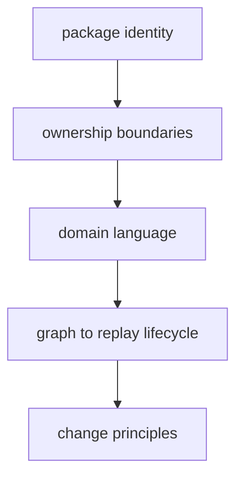

# DAG Foundation

The foundation section defines DAG intent and limits before architecture or
command details: mission, scope boundaries, domain vocabulary, lifecycle model,
and change principles.

## Visual Summary

## What This Section Covers

- what `bijux-dag` is built to solve
- what it intentionally does not claim
- responsibility boundaries across DAG crates
- terms used for identity, replay, and diff classification
- principles for safe long-term DAG evolution

## Code Anchors

- `crates/bijux-dag-app/CONTRACT.md`
- `crates/bijux-dag-core/CONTRACT.md`
- `crates/bijux-dag-runtime/CONTRACT.md`
- `crates/bijux-dag-artifacts/CONTRACT.md`

## Pages In This Section

- [Package Overview](package-overview.md)
- [Scope and Non-Goals](scope-and-non-goals.md)
- [Ownership Boundary](ownership-boundary.md)
- [Repository Fit](repository-fit.md)
- [Capability Map](capability-map.md)
- [Domain Language](domain-language.md)
- [Lifecycle Overview](lifecycle-overview.md)
- [Dependencies and Adjacencies](dependencies-and-adjacencies.md)
- [Change Principles](change-principles.md)
