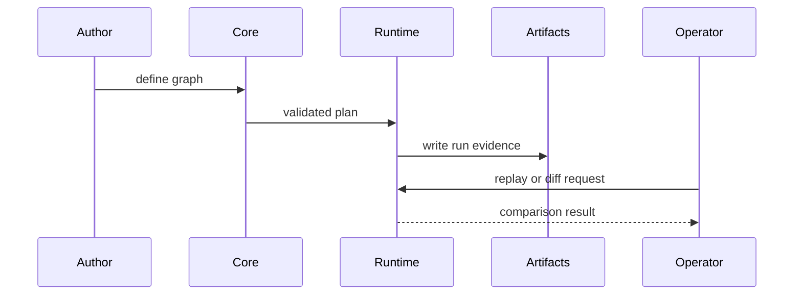

# Lifecycle Overview

This page explains the shortest path a DAG follows from definition to
comparison-ready evidence.

The point of the lifecycle is simple: DAG work is not finished when nodes run.
It is finished when the run can be inspected, replayed, and compared honestly.

## Lifecycle Flow

## Lifecycle Stages

1. definition parse/validate/canonicalize
2. planning and scheduler eligibility computation
3. node execution and outcome capture
4. run/artifact persistence with lineage links
5. replay and diff classification against baselines
6. operator release or incident decision

## Code Anchors

- `crates/bijux-dag-core/src/pipeline/`
- `crates/bijux-dag-runtime/src/runtime_core/`
- `crates/bijux-dag-artifacts/src/storage/`
- `crates/bijux-dag-app/src/replay/`
- `crates/bijux-dag-app/src/routes/`

## Reading Rule

Use this page when a DAG problem is visible in the final result but it is not
yet clear whether the break is in definition, execution, evidence capture, or
comparison.

## Next Reads

- [Execution Model](../architecture/execution-model.md)
- [Common Workflows](../operations/common-workflows.md)
- [Failure Recovery](../operations/failure-recovery.md)
