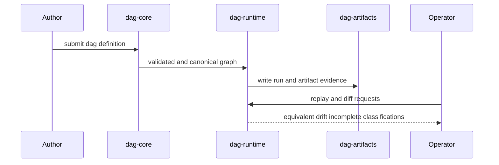

# Lifecycle Overview

The DAG lifecycle is evidence-first: define graph, execute run, persist
artifacts, then classify replay/diff outcomes before promotion decisions.

## Visual Summary

## Lifecycle Stages

1. definition parse/validate/canonicalize
2. planning and scheduler eligibility computation
3. node execution and outcome capture
4. run/artifact persistence with lineage links
5. replay and diff classification against baselines
6. operator release or incident decision

## Code Anchors

- `crates/bijux-dag-core/src/pipeline/`
- `crates/bijux-dag-runtime/src/runtime_core/`
- `crates/bijux-dag-artifacts/src/storage/`
- `crates/bijux-dag-app/src/replay/`
- `crates/bijux-dag-app/src/routes/`

## Next Reads

- [Execution Model](../architecture/execution-model.md)
- [Common Workflows](../operations/common-workflows.md)
- [Failure Recovery](../operations/failure-recovery.md)
