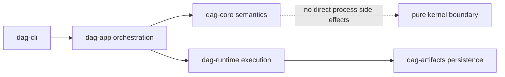

# Ownership Boundary

DAG behavior is split intentionally across crates. This boundary prevents CLI
wrappers, runtime internals, and artifact storage logic from bleeding into each
other.

## Visual Summary

## Ownership Rules

- `bijux-dag-cli` owns process entry and shell completion wiring only.
- `bijux-dag-app` owns command orchestration and response formatting.
- `bijux-dag-core` owns deterministic graph semantics and planner lowering.
- `bijux-dag-runtime` owns execution engine, scheduler, policy, and replay logic.
- `bijux-dag-artifacts` owns artifact formats, integrity, and lifecycle helpers.

## Boundary Tests

- app crate boundary checks: `crates/bijux-dag-app/tests/crate_boundary_contract.rs`
- runtime boundaries: `crates/bijux-dag-runtime/tests/`
- core purity and identity behavior: `crates/bijux-dag-core/tests/`

## Code Anchors

- `crates/bijux-dag-app/CONTRACT.md`
- `crates/bijux-dag-core/CONTRACT.md`
- `crates/bijux-dag-runtime/CONTRACT.md`
- `crates/bijux-dag-artifacts/CONTRACT.md`

## Next Reads

- [Release Boundary](release-boundary.md)
- [Dependency Direction](../architecture/dependency-direction.md)
- [Review Checklist](../quality/review-checklist.md)
