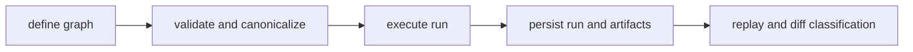

# Package Overview

`bijux-dag` exists to answer a hard operational question with evidence instead of
guesswork: when behavior changed, was it graph definition drift, runtime
execution drift, or artifact/output drift?

## Visual Summary

## What DAG Owns

- deterministic DAG model parsing, validation, and identity
- run execution orchestration with explicit policy boundaries
- artifact identity, lineage, and persistence contracts
- replay and diff classification semantics for operator decisions

## Crate Ownership Map

- `bijux-dag-cli`: thin binary and top-level command routing
- `bijux-dag-app`: command orchestration and response shaping
- `bijux-dag-core`: pure DAG kernel (parse, validate, canonicalize, plan)
- `bijux-dag-runtime`: execution engine, scheduler, replay, policy, diagnostics
- `bijux-dag-artifacts`: artifact models, storage, integrity, lifecycle

## Code Anchors

- `crates/bijux-dag-cli/src/main.rs`
- `crates/bijux-dag-app/src/lib.rs`
- `crates/bijux-dag-core/src/lib.rs`
- `crates/bijux-dag-runtime/src/lib.rs`
- `crates/bijux-dag-artifacts/src/lib.rs`

## Next Reads

- [Scope and Non-Goals](scope-and-non-goals.md)
- [Module Map](../architecture/module-map.md)
- [CLI Surface](../interfaces/cli-surface.md)
