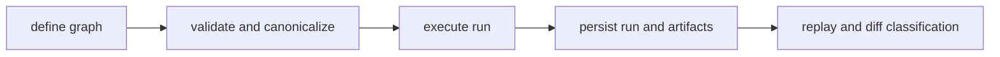

# Package Overview

`bijux-dag` exists to answer a hard operational question with evidence instead of
guesswork: when behavior changed, was it graph definition drift, runtime
execution drift, or artifact/output drift?

## Visual Summary

## What The DAG Package Family Owns

- deterministic DAG parsing, validation, and identity
- run execution orchestration with explicit policy boundaries
- retained artifact identity, lineage, and persistence contracts
- replay and diff classification that operators can verify from run evidence

## Reader Shortcut

If the problem starts with one of these questions, you are in the right place:

- Did the graph change, or did runtime behavior change?
- Which crate owns replay, cache, scheduler, or artifact behavior?
- Where should I read before opening `bijux-dag-runtime` or `bijux-dag-core`?
- Which layer turns a validated graph into retained evidence I can inspect?

## Crate Ownership Map

- `bijux-dag-cli`: thin binary and top-level command routing
- `bijux-dag-app`: command orchestration and response shaping
- `bijux-dag-core`: pure DAG kernel for parse, validate, canonicalize, and plan
- `bijux-dag-runtime`: execution engine, scheduler, replay, policy, and diagnostics
- `bijux-dag-artifacts`: artifact models, storage, integrity, and lifecycle

## Code Anchors

- `crates/bijux-dag-cli/src/main.rs`
- `crates/bijux-dag-app/src/lib.rs`
- `crates/bijux-dag-core/src/lib.rs`
- `crates/bijux-dag-runtime/src/lib.rs`
- `crates/bijux-dag-artifacts/src/lib.rs`

## Read Next

- [CLI Surface](../interfaces/cli-surface.md) for the operator contract
- [Module Map](../architecture/module-map.md) for crate boundaries
- [Packages](../packages/index.md) when you need the exact owning crate
