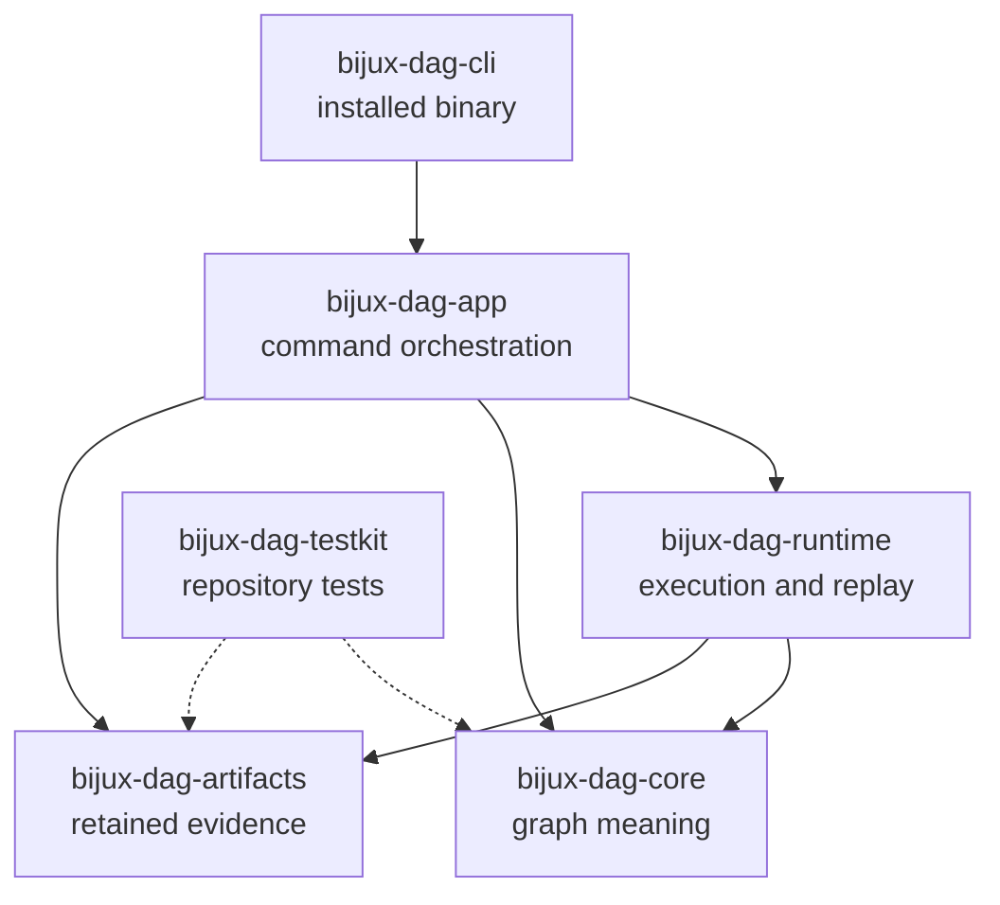

# Package Overview

`bijux-dag` is a family of crates with one installed command. The split keeps
graph meaning, retained evidence, execution, application orchestration, and
process startup independently reviewable. Most operators should install only
`bijux-dag-cli`; library consumers should depend on the narrowest crate that
owns the behavior they need.

## Package Flow

Arrows are direct workspace dependencies. The testkit edges are shown
separately because `bijux-dag-testkit` is repository-internal and must not
become a production dependency.

## Ownership And Release Status

| Crate | Stable responsibility | Publication |
| --- | --- | --- |
| `bijux-dag-core` | graph types, validation, canonicalization, identity, and deterministic planning inputs | public |
| `bijux-dag-artifacts` | run records, indexes, integrity, lineage, import/export, retention, and promotion evidence | public |
| `bijux-dag-runtime` | execution planning, scheduling, backends, cache decisions, replay, and runtime state transitions | public |
| `bijux-dag-app` | command use cases, release-lane policy, request validation, and response shaping | public |
| `bijux-dag-cli` | `bijux-dag` process startup, argument entrypoint, completion, and exit mapping | public |
| `bijux-dag-testkit` | deterministic fixtures, fake adapters, scenario builders, and shared assertions | private |

Public/private status is governed by
`contracts/foundation/workspace_package_boundary.v1.json`. Operator command
stability is a separate question governed by
`contracts/foundation/dag_release_truth_table.v1.json`. A public crate may
contain callable APIs that are not part of the stable operator command lane.

## Choose The Right Surface

Use `bijux-dag-cli` when you want to:

- validate, plan, run, replay, inspect, compare, or verify workflows from a
  shell or automation system
- install one supported executable without assembling the lower layers
- consume stable JSON command output and exit behavior

Use `bijux-dag-app` when a Rust program needs the same command orchestration and
response models without starting the standalone binary.

Use `bijux-dag-runtime` when a Rust program owns its presentation layer and
needs execution, backend, cache, or replay services. Runtime use still requires
the caller to preserve the artifact and policy contracts expected by those
services.

Use `bijux-dag-core` when the requirement stops at graph parsing, validation,
canonical identity, or planning inputs. Core deliberately excludes filesystem,
process, environment, and clock access.

Use `bijux-dag-artifacts` when the requirement is to read, write, verify, or
reason about retained DAG evidence without executing a graph.

Use `bijux-dag-testkit` only inside repository-owned tests. It is not published,
does not define product behavior, and is not a supported dependency for
external consumers.

## One Product, Separate Proof Questions

The package split prevents one successful operation from proving too much:

| Claim | Owning evidence |
| --- | --- |
| the graph is accepted and has a stable identity | core validation and canonicalization |
| execution followed the requested policy | runtime plan, node attempts, and state transitions |
| retained bytes match their records | artifact indexes, sizes, digests, and strict verification |
| the command is supported for operators | app release-lane policy and visible CLI help |
| the executable started and mapped the result correctly | CLI process and exit behavior |

A completed process does not prove artifact integrity. A verified run does not
prove domain correctness. A callable internal route does not make that route a
stable release commitment.

## Source Authorities

- dependency edges: package `Cargo.toml` files and
  `crates/bijux-dev/tests/dependency_boundary_contracts.rs`
- crate publication:
  `contracts/foundation/workspace_package_boundary.v1.json`
- operator release lanes:
  `contracts/foundation/dag_release_truth_table.v1.json`
- executable entrypoint: `crates/bijux-dag-cli/src/main.rs`
- shared repository fixtures: `crates/bijux-dag-testkit/src/`

## Continue By Intent

- [Installation And Setup](../operations/installation-and-setup.md) for the
  installed and source-checkout paths
- [Release Boundary](release-boundary.md) for stable and gated commands
- [Module Map](../architecture/module-map.md) for internal ownership
- [Packages](../packages/index.md) for crate-specific public surfaces
- [Artifact Contracts](../interfaces/artifact-contracts.md) for retained
  evidence authority
