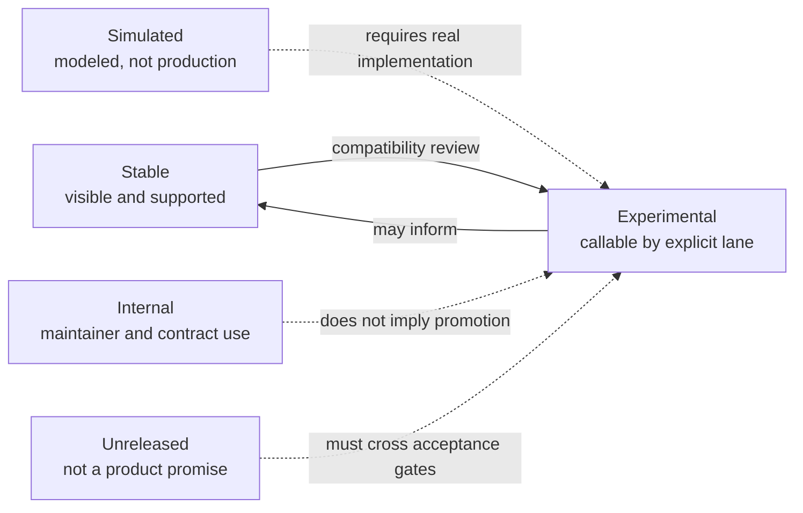

# Release Boundary

The repository contains more command routes than the supported `v0.4.0`
operator surface. Release status is explicit so that discoverability cannot be
mistaken for compatibility.

The machine-readable authority is
`contracts/foundation/dag_release_truth_table.v1.json`. This page explains how
to use that authority when operating, integrating, or reviewing the product.

## Four Command Lanes And One Exclusion Boundary

The arrows do not describe an automatic maturity sequence. Promotion requires
a deliberate release decision backed by implementation, documentation,
contract tests, compatibility review, and operator evidence.

## `v0.4.0` Surface Truth

| Lane | Operator meaning | Discovery and activation |
| --- | --- | --- |
| stable | supported visible command surface for authoring, executing, replaying, and inspecting DAG work | `bijux-dag --help` and `bijux-dag commands` |
| experimental | repository-tested helpers callable by deliberate opt-in, outside stable compatibility | `bijux-dag commands --lane experimental` |
| simulated | modeled platform namespaces, not production services or backends | `BIJUX_DAG_ENABLE_SIMULATED=1` and `bijux-dag commands --lane simulated` |
| internal | maintainer-only and contract-only routes outside the public operator boundary | `BIJUX_DAG_ENABLE_INTERNAL=1` and `bijux-dag commands --lane internal` |
| unreleased | absent from the `v0.4.0` product promise | no supported activation path |

### Stable commands

`validate`, `artifact-inspect`, `artifact`, `commands`, `plan`, `run`,
`replay`, `runs`, `diff`, `explain`, `verify`, `doctor`, `cache`, `version`,
and `completions`.

### Experimental commands

`init`, `canonicalize`, `graph`, `graph-lint`, `fingerprint`, `hash`,
`status`, `node`, `trace-artifact`, `why-rerun`, `why-cache-missed`, `export`,
`import`, `migrate`, `adapters`, `config`, `policy`, `fsck`, `prove`, and
`proof-summary`.

### Simulated namespaces

`control-plane`, `state-store`, `dataset`, `enterprise`, `fleet`,
`governance`, `federation`, `incident`, and `lab`.

### Internal namespaces

`security`, `durability`, `performance`, `release`, `runtime`, `schedule`,
`version-inspect`, `capabilities`, `semantic-portability`, and
`equivalence-proof`.

The lists above describe root routes. Subcommand availability, arguments, and
response schemas remain governed by the command help and documented interface
contracts.

## Stable Capability Envelope

The stable release includes:

- local DAG validation and local execution;
- Kubernetes Job submission through `run --backend kubernetes` for container
  nodes, using `kubectl` with request and limit mapping, active-deadline
  mapping, pod-phase mapping, shared workspace mounting, and retained batch
  evidence;
- shared-filesystem SLURM submission through `run --backend slurm`, using
  `sbatch` and `sacct` with retained batch evidence;
- run and artifact evidence inspection;
- replay and diff classification;
- cache verification and maintenance; and
- machine-readable JSON output.

The Kubernetes and SLURM lanes are stable within those exact constraints.
“Stable” does not mean the runtime owns cluster availability, admission,
identity, secrets, quota, networking, or storage policy.

## Unreleased Claims

The following are not `v0.4.0` promises:

- generic HPC execution beyond the shared-filesystem SLURM lane;
- public remote-worker execution;
- public enterprise, fleet, federation, or governance operator APIs; and
- a full scheduler service.

Simulated namespaces may model vocabulary associated with these capabilities.
That modeling is useful for contract exploration, but it is not evidence of a
production implementation.

## Integration Rules

- Build production procedures and automation on the stable lane only.
- Pin the product version and validate machine-readable output against the
  documented schema instead of scraping human text.
- Treat an experimental command as an explicit integration risk; it can change
  without the stable compatibility guarantees.
- Never enable simulated or internal lanes globally in an operator
  environment. Enable them only for the bounded invocation that needs them.
- Reject documentation, release notes, or support claims that promote a route
  merely because it exists in source.

## What Promotion Requires

A capability can enter the stable lane only when all of the following are true:

1. The implementation represents a real operator path, not a simulated
   response.
2. Failure, timeout, cancellation, and partial-evidence behavior are defined.
3. Human and machine-readable interfaces have compatibility contracts.
4. Backend prerequisites and security boundaries are documented.
5. Tests exercise the supported path and its failure modes.
6. The release truth table, CLI discovery, docs, and release evidence agree.

## Package Publication Is A Separate Boundary

Command stability and crate publication answer different questions. Five DAG
crates are public release artifacts; `bijux-dag-testkit` is private repository
support. Use [Package Boundary](../../bijux-core/foundation/package-boundary.md)
and `contracts/foundation/workspace_package_boundary.v1.json` for that
authority.

## Continue Reading

- [Scope and Boundaries](scope-and-boundaries.md) for the product promise
- [CLI Surface](../interfaces/cli-surface.md) for command contracts
- [DAG Packages](../packages/index.md) for implementation ownership
- [Known Limitations](../quality/known-limitations.md) for current gaps
- [Future Direction](future-direction.md) for direction that is not a release
  commitment
