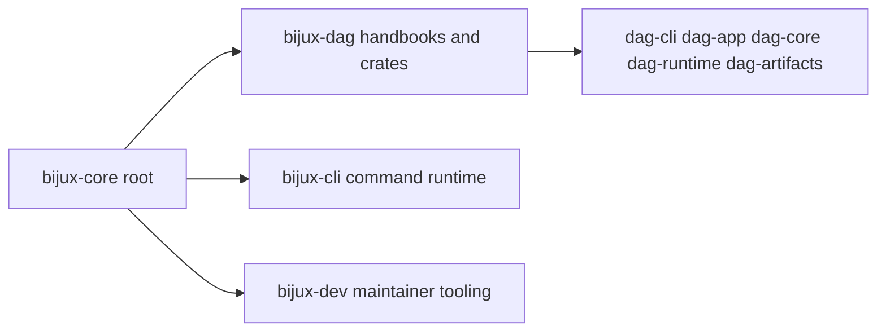

# Repository Fit

`bijux-dag` is one product area inside `bijux-core`. It shares repository policy
and release infrastructure, but it owns its own semantic contracts and evidence
workflows.

## Visual Summary

## Fit Rules

- DAG docs define DAG semantics, not umbrella repository policy.
- CLI docs own generic `bijux` command runtime concerns.
- Maintainer docs own automation, audit, and governance operations.
- Cross-package claims belong in repository handbook pages.

## Code Anchors

- `crates/bijux-dag-cli/`
- `crates/bijux-dag-app/`
- `crates/bijux-dag-core/`
- `crates/bijux-dag-runtime/`
- `crates/bijux-dag-artifacts/`

## Next Reads

- [Dependencies and Adjacencies](dependencies-and-adjacencies.md)
- [Integration Seams](../architecture/integration-seams.md)
- [Deployment Boundaries](../operations/deployment-boundaries.md)
