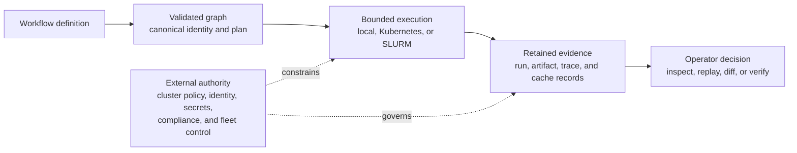

# Scope and Boundaries

`bijux-dag` is a local-first workflow runtime that makes graph decisions,
execution decisions, and retained evidence inspectable. Its product promise is
not “run anything anywhere.” It is narrower and more useful: validate a
workflow before execution, make backend capability differences explicit, and
retain enough evidence to explain what happened afterward.

Use this page to decide whether a workflow belongs inside the supported product
boundary before choosing a command or package.

## The Product Boundary

The product owns the solid path. It records the inputs and decisions needed to
reason about a run, but it does not replace the external authorities shown
below the path.

## Supported Outcomes

| You need to... | `bijux-dag` provides... | The boundary remains... |
| --- | --- | --- |
| reject an invalid or ambiguous workflow before work begins | parsing, validation, canonicalization, deterministic identity, and planning | domain correctness inside commands and scripts remains the workflow author's responsibility |
| execute a validated graph | local execution plus bounded Kubernetes Job and shared-filesystem SLURM adapters | cluster admission, credentials, quotas, node health, and scheduler availability remain external |
| understand a completed or failed run | retained run, node, artifact, trace, and cache evidence | evidence integrity does not prove the scientific or business validity of the computation |
| decide whether work can be reused | cache eligibility, verification, replay decisions, and explicit refusal reasons | changed tools, environments, or missing evidence can make equivalence unknown |
| compare executions | graph, run, and artifact-aware diff classifications | incomplete evidence is reported as incomplete or unknown, never promoted to equivalence |
| automate operator decisions | stable commands, documented exit behavior, and machine-readable JSON | callers must pin the supported release and honor schema and compatibility commitments |

## Execution Backends

The supported backends do not claim identical semantics.

| Backend | Supported lane | Required environment | Important limit |
| --- | --- | --- | --- |
| local | stable | local process and filesystem access | commands execute with the privileges and isolation of the invoking environment |
| Kubernetes | stable for container nodes | `kubectl`, an accessible cluster, a persistent volume claim, and a shared root | submits Kubernetes Jobs; it is not a cluster scheduler or control plane |
| SLURM | stable for the shared-filesystem lane | `sbatch`, `sacct`, and a run directory visible to submit and compute nodes | does not promise generic HPC portability or non-shared storage transport |

Backend selection is therefore a capability decision, not a cosmetic switch.
The runtime must reject unsupported requirements or expose a deliberate
downgrade; it must not silently pretend that two environments are equivalent.

## Explicit Non-Goals

`bijux-dag` does not currently promise:

- a hosted scheduler service or remote-worker control plane;
- generic HPC execution beyond the documented shared-filesystem SLURM lane;
- public enterprise, fleet, federation, or governance APIs;
- uniform isolation, identity, networking, or secret delivery across backends;
- proof that a command, model, or dataset is scientifically correct;
- replacement of organization-wide security, compliance, retention, or
  incident-management systems; or
- compatibility for every command present in the repository.

Experimental, simulated, and maintainer-only commands exist for deliberate
development and contract work. Their presence is not a release claim. The
[Release Boundary](release-boundary.md) defines those lanes precisely.

## Failure And Evidence Semantics

The system keeps three statements separate:

1. **Execution state** says whether work was accepted, started, completed,
   failed, or could not be classified.
2. **Evidence integrity** says whether retained records and artifacts still
   match their recorded identities.
3. **Equivalence** says whether available evidence is sufficient to classify
   two scopes as equivalent, drifted, incomplete, or unknown.

A successful process exit does not guarantee valid evidence. Valid evidence
does not guarantee equivalent environments. Missing evidence never becomes a
successful comparison by default.

Replay with `--sandbox` protects the source run from replay writes; it is not an
operating-system process sandbox. Workload isolation must come from the chosen
execution environment.

## Choose The Next Contract

| Question | Continue with |
| --- | --- |
| Is this command or capability supported by the current release? | [Release Boundary](release-boundary.md) |
| Which crate is allowed to define this behavior? | [Ownership Boundary](ownership-boundary.md) |
| Which package should receive a change? | [DAG Packages](../packages/index.md) |
| What must remain compatible? | [Compatibility Commitments](../interfaces/compatibility-commitments.md) |
| Which gaps are currently known? | [Known Limitations](../quality/known-limitations.md) |
| What is direction rather than a promise? | [Future Direction](future-direction.md) |

## Source Anchors

- release claims: `contracts/foundation/dag_release_truth_table.v1.json`
- graph semantics: `crates/bijux-dag-core/src/`
- execution and replay: `crates/bijux-dag-runtime/src/`
- operator workflows: `crates/bijux-dag-app/src/`
- evidence integrity: `crates/bijux-dag-artifacts/src/`
