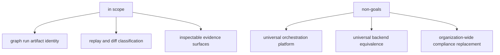

# Scope and Non-Goals

Scope discipline keeps DAG claims trustworthy. This page makes explicit what
`bijux-dag` must defend and what it does not promise.

## Visual Summary

## In Scope

- DAG model validity and canonical semantics
- deterministic run and artifact evidence surfaces
- replay and diff contract vocabularies (`equivalent`, `drift`, `incomplete`/`unknown`)
- bounded backend capability semantics and explicit downgrade handling

## Non-Goals

- claiming equal behavior across all backends and environments
- masking missing evidence as successful equivalence
- collapsing graph/run/artifact scopes into one generic change signal
- shipping simulated platform-control namespaces as stable operator APIs
- replacing organization security/compliance policy systems

The current hidden experimental and simulation surfaces remain constrained by
`LIM-005` and `LIM-006` in [Known Limitations](../quality/known-limitations.md).
The post-`v0.4.0` promotion path for scheduling, remote workers, and cluster
backends lives in the [Bijux Dag Roadmap](../../tracking/bijux-dag-roadmap.md).

## Code Anchors

- `crates/bijux-dag-core/src/`
- `crates/bijux-dag-runtime/src/replay/`
- `crates/bijux-dag-app/src/routes/diff_routes.rs`
- `crates/bijux-dag-artifacts/src/integrity/`

## Next Reads

- [Ownership Boundary](ownership-boundary.md)
- [Bijux Dag Roadmap](../../tracking/bijux-dag-roadmap.md)
- [Compatibility Commitments](../interfaces/compatibility-commitments.md)
- [Known Limitations](../quality/known-limitations.md)
