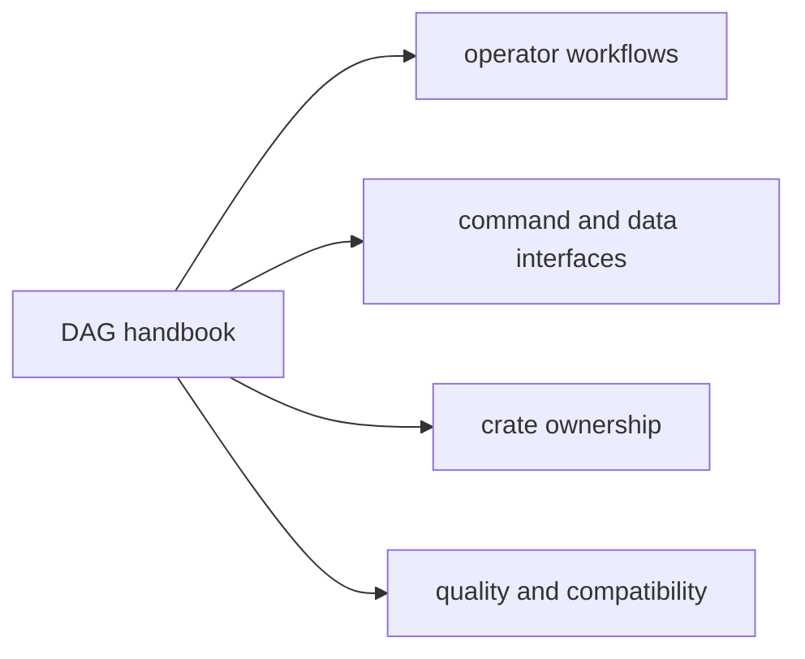

# DAG Handbook

`bijux-dag` is the deterministic graph product in `bijux-core`. It owns graph
validation, execution planning, local run orchestration, replay, artifact
identity, evidence inspection, and drift attribution.

Use this handbook when the question is about DAG behavior itself: what gets
validated, what gets executed, what evidence is written, and which crate owns
the answer once the route is clear.

The public `v0.4.0` product boundary is intentionally local-first. Stable DAG
commands cover local validation, planning, execution, replay, inspection,
cache work, and verification. Simulated namespaces and maintainer-only routes
remain documented because they exist in the repository, but they are not being
presented as shipped production backends or public platform APIs.

The current public crate family is:

- `bijux-dag-core` for graph truth and planner inputs
- `bijux-dag-artifacts` for run evidence, integrity, and lifecycle helpers
- `bijux-dag-runtime` for execution policy, replay, cache, and diagnostics
- `bijux-dag-app` for command orchestration and response shaping
- `bijux-dag-cli` for the thin `bijux-dag` executable wrapper

`bijux-dag-testkit` remains repository-internal support for deterministic DAG
fixtures and shared assertions.

Runtime identity in manifests, provenance, replay, and cache fingerprints is
stamped from build metadata. Running the same compiled binary from a different
working directory is not supposed to rewrite DAG evidence identity.

The supported operator boundary is the visible `bijux-dag --help` surface.
Repository-owned experimental routes remain callable by explicit path and are
inventoryable through `bijux-dag commands --lane experimental`. Modeled-platform
namespaces and maintainer namespaces require `BIJUX_DAG_ENABLE_SIMULATED=1` or
`BIJUX_DAG_ENABLE_INTERNAL=1`, plus deliberate lane inventory through
`bijux-dag commands --lane simulated` or `bijux-dag commands --lane internal`.
None of those lanes are part of the stable operator compatibility lane.

## v0.4.0 Surface Truth Table

| Class | `v0.4.0` meaning | Representative surfaces |
| --- | --- | --- |
| stable | supported visible `bijux-dag --help` surface for local DAG authoring, execution, replay, and evidence inspection | `validate`, `plan`, `run`, `replay`, `runs ...`, `artifact`, `artifact-inspect`, `diff`, `explain`, `verify`, `doctor`, `cache`, `version`, `commands`, `completions` |
| experimental | callable by explicit path and repository-tested, but outside the stable operator compatibility lane | explicit-path operator helpers such as `init`, `status`, `export`, `migrate`, `prove`, and `trace-artifact`; use `bijux-dag commands --lane experimental` for the current inventory |
| simulated | modeled platform namespaces that require `BIJUX_DAG_ENABLE_SIMULATED=1`, not production backends or services | modeled control-plane and organizational route families; use `bijux-dag commands --lane simulated` only when you intentionally need repository-owned modeling surfaces |
| internal | maintainer-only and contract-only routes that require `BIJUX_DAG_ENABLE_INTERNAL=1` and stay outside the public operator boundary | maintainer verification, schedule, runtime, release, and capability lanes; use `bijux-dag commands --lane internal` only for deliberate repository maintenance work |
| future | not a `v0.4.0` product promise | generic hpc execution beyond the shared-filesystem slurm lane, public remote workers, public enterprise or federation APIs, full scheduler service |

For the canonical operator-surface source, use
[Release Boundary](foundation/release-boundary.md). For crate publication
status, use [Package Boundary](../bijux-core/foundation/package-boundary.md).
For what comes after the local-first `v0.4.0` boundary, use the
[Bijux Dag Roadmap](../tracking/bijux-dag-roadmap.md).

Within that boundary, `run --backend slurm` is real: it submits nodes through
`sbatch`, polls `sacct`, and writes retained batch evidence when the scheduled
worker can reopen the same run directory on a shared filesystem.

Within that boundary, `run --backend kubernetes` is also real for container
nodes: it submits Kubernetes Jobs through `kubectl`, mounts retained node
inputs, outputs, and work directories through a shared persistent volume
claim, and writes retained batch evidence per node.

<a class="md-button md-button--primary" href="operations/guides/first-hour-with-bijux-dag.md">Start with the first hour guide</a>
<a class="md-button" href="operations/v0-4-0-release-notes.md">Read the v0.4.0 release notes</a>
<a class="md-button" href="operations/guides/branching-bulletin-workflow.md">Run the branch workflow</a>
<a class="md-button" href="operations/guides/cache-behavior-workflow.md">Run the cache workflow</a>
<a class="md-button" href="operations/guides/compliance-gated-bulletin-workflow.md">Run the recovery workflow</a>
<a class="md-button" href="operations/guides/container-packaging-workflow.md">Run the container workflow</a>
<a class="md-button" href="operations/guides/data-pipeline-workflow.md">Run the data pipeline workflow</a>
<a class="md-button" href="operations/guides/file-processing-workflow.md">Run the file processing workflow</a>
<a class="md-button" href="interfaces/operator-workflows.md">Open operator workflows</a>
<a class="md-button" href="packages/index.md">Open the package map</a>

## Reader Map

## Start Here

- open [First Hour With Bijux Dag](operations/guides/first-hour-with-bijux-dag.md)
  when you want a concrete local path from install to a verified run
- open [v0.4.0 Release Notes](operations/v0-4-0-release-notes.md) when you
  need the honest release boundary, examples, migration notes, limitations,
  and validation commands in one operator-facing page
- open [Data Pipeline Workflow](operations/guides/data-pipeline-workflow.md)
  when you want retained-run comparison and changed-input attribution on a real
  structured workflow
- open [Cache Behavior Workflow](operations/guides/cache-behavior-workflow.md)
  when you need proof that warm reuse, selective invalidation, corruption
  refusal, and cache-miss explanation all work on one real retained workflow
- open [Container Packaging Workflow](operations/guides/container-packaging-workflow.md)
  when you need proof that container nodes receive mounted inputs, write
  retained outputs, and record engine identity
- open [Branching Bulletin Workflow](operations/guides/branching-bulletin-workflow.md)
  when you need proof that branch decisions, skipped lanes, join rules, and
  replay stability are visible in retained run evidence
- open [Compliance-Gated Bulletin Workflow](operations/guides/compliance-gated-bulletin-workflow.md)
  when you need proof that retry evidence, failure attribution, focused replay,
  and strict post-repair verification all work on one real run sequence
- open [Operator Workflows](interfaces/operator-workflows.md) when the question
  is how to validate, run, replay, inspect, or compare
- open [CLI Surface](interfaces/cli-surface.md) when the question is command
  discovery or route classification
- open [Graph Schema Reference](interfaces/reference/graph-schema.md) when the
  question is what a DAG file may declare, from graph inputs through validation
  errors
- open [Run Evidence Layout](interfaces/reference/run-evidence-layout.md) when
  the question is where manifests, traces, indexes, cache records, or
  promotion records live on disk after a run completes
- open [Reproducibility Model](interfaces/reference/reproducibility-model.md)
  when the question is which fingerprint, hash, cache proof, or replay bundle
  surface actually answers the identity question in front of you
- open [Security And Isolation Truth](operations/reference/security-isolation-truth.md)
  when the question is which execution-boundary protections are enforced,
  best-effort, or not provided at all
- open [Generated CLI Reference](interfaces/generated-cli-reference.md) when
  the question is the exact stable command syntax and current help text
- open [Non-Stable Command Inventory](interfaces/reference/nonstable-command-inventory.md)
  when you intentionally need the current experimental, simulated, or internal
  route inventory without mixing it into the stable operator contract
- open [Bijux Dag Roadmap](../tracking/bijux-dag-roadmap.md) when the question
  is which capability lane may come next after `v0.4.0` and what still has to
  be proven before that claim becomes real
- open [Capability Map](foundation/capability-map.md) when you need the product
  responsibilities before the crate split
- open [DAG Packages](packages/index.md) when the route is clear but the owning
  crate is not

## Package Destinations

- [`bijux-dag-core`](packages/bijux-dag-core.md) owns graph truth and planner lowering
- [`bijux-dag-runtime`](packages/bijux-dag-runtime.md) owns execution policy, replay, and diagnostics
- [`bijux-dag-app`](packages/bijux-dag-app.md) owns command orchestration and response shaping
- [`bijux-dag-cli`](packages/bijux-dag-cli.md) owns the thin executable wrapper
- [`bijux-dag-artifacts`](packages/bijux-dag-artifacts.md) owns artifact identity, integrity, and lifecycle helpers
- [`bijux-dag-testkit`](packages/bijux-dag-testkit.md) owns shared deterministic fixtures for repository tests and maintainer suites

## Workflow Spine

The public workflow is intentionally local and evidence-driven:

1. validate the graph
2. preview or run it
3. inspect run and artifact evidence
4. replay when reproducibility matters
5. diff or compare when attribution matters

That spine is reflected across the operator docs, the crate split, and the
stable CLI surface.

## Internal Evidence Lanes

These references stay in the handbook because they are real repository-backed
evidence, but they remain outside the stable `v0.4.0` operator contract.

- open [Historical Catalog Backfill Workflow](operations/guides/historical-catalog-backfill-workflow.md)
  when you intentionally need the current internal backfill lane for partition
  fanout, durable summary state, and failed-partition retry evidence
- open [Scheduled Catalog Refresh Workflow](operations/guides/scheduled-catalog-refresh-workflow.md)
  when you intentionally need the current internal schedule lane for cron
  preview, durable submission, queue dispatch, and run-id handoff evidence

## Code Anchors

- `crates/bijux-dag-cli/src/main.rs`
- `crates/bijux-dag-app/src/`
- `crates/bijux-dag-core/src/`
- `crates/bijux-dag-runtime/src/`
- `crates/bijux-dag-artifacts/src/`

## Main Paths

- [Foundation](foundation/index.md)
- [Architecture](architecture/index.md)
- [Interfaces](interfaces/index.md)
- [Operations](operations/index.md)
- [Packages](packages/index.md)
- [Quality](quality/index.md)

## Related Handbooks

- [Repository Handbook](../bijux-core/index.md)
- [CLI Handbook](../bijux-cli/index.md)
- [Maintainer Handbook](../bijux-dev/index.md)

## Contract Anchors

- [Planner Contract](../spec/PLANNER_CONTRACT.md)
- [Replay Contract](../spec/REPLAY_CONTRACT.md)
