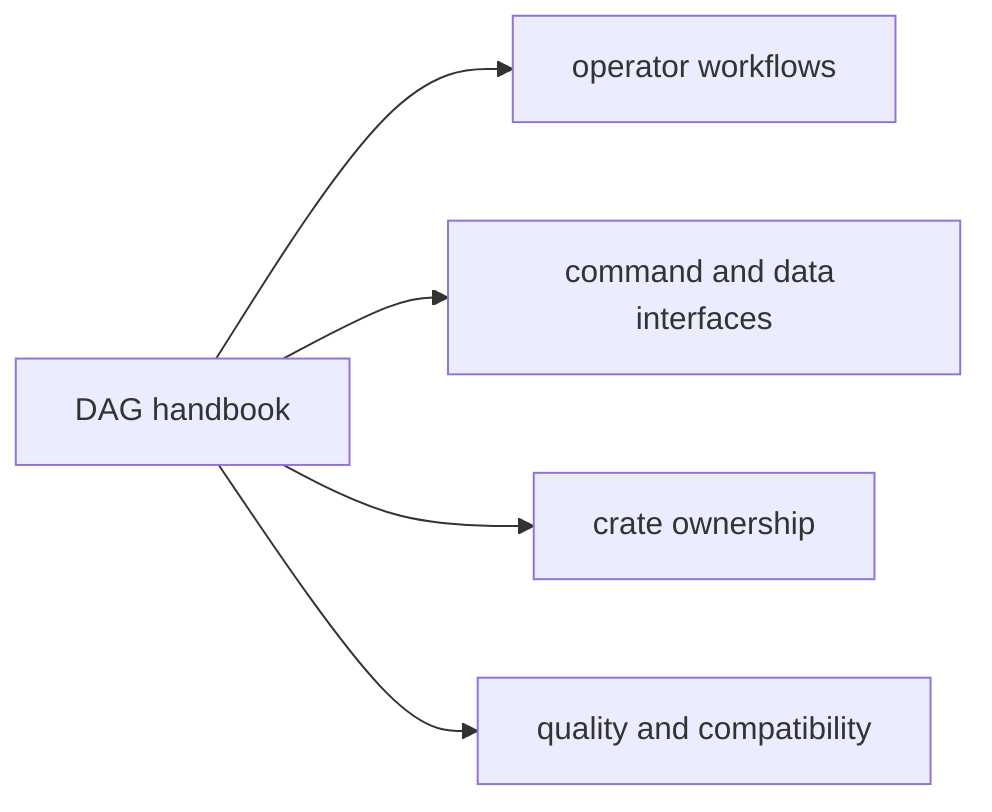

# DAG Handbook

`bijux-dag` is the deterministic graph product in `bijux-core`. It owns graph
validation, execution planning, local run orchestration, replay, artifact
identity, evidence inspection, and drift attribution.

Use this handbook when the question is about DAG behavior itself: what gets
validated, what gets executed, what evidence is written, and which crate owns
the answer once the route is clear.

The public `v0.4.0` product boundary is intentionally local-first. Stable DAG
commands cover local validation, planning, execution, replay, inspection,
cache work, and verification. Simulated namespaces and maintainer-only routes
remain documented because they exist in the repository, but they are not being
presented as shipped production backends or public platform APIs.

The current public crate family is:

- `bijux-dag-core` for graph truth and planner inputs
- `bijux-dag-artifacts` for run evidence, integrity, and lifecycle helpers
- `bijux-dag-runtime` for execution policy, replay, cache, and diagnostics
- `bijux-dag-app` for command orchestration and response shaping
- `bijux-dag-cli` for the thin `bijux-dag` executable wrapper

`bijux-dag-testkit` remains repository-internal support for deterministic DAG
fixtures and shared assertions.

Runtime identity in manifests, provenance, replay, and cache fingerprints is
stamped from build metadata. Running the same compiled binary from a different
working directory is not supposed to rewrite DAG evidence identity.

The supported operator boundary is the visible `bijux-dag --help` surface.
Repository-owned experimental routes remain callable by explicit path.
Modeled-platform namespaces and maintainer namespaces require
`BIJUX_DAG_ENABLE_SIMULATED=1` or `BIJUX_DAG_ENABLE_INTERNAL=1` and are not
part of the stable operator compatibility lane.

## v0.4.0 Surface Truth Table

| Class | `v0.4.0` meaning | Representative surfaces |
| --- | --- | --- |
| stable | supported visible `bijux-dag --help` surface for local DAG authoring, execution, replay, and evidence inspection | `validate`, `plan`, `run`, `replay`, `runs ...`, `artifact`, `artifact-inspect`, `diff`, `explain`, `verify`, `doctor`, `cache`, `version`, `commands`, `completions` |
| experimental | callable by explicit path and repository-tested, but outside the stable operator compatibility lane | `init`, `canonicalize`, `graph`, `graph-lint`, `fingerprint`, `hash`, `status`, `node`, `trace-artifact`, `why-rerun`, `why-cache-missed`, `export`, `import`, `migrate`, `adapters`, `config`, `policy`, `fsck`, `prove`, `proof-summary` |
| simulated | modeled platform and control-plane namespaces that require `BIJUX_DAG_ENABLE_SIMULATED=1`, not production backends or services | `control-plane`, `state-store`, `dataset`, `enterprise`, `fleet`, `governance`, `federation`, `incident`, `lab` |
| internal | maintainer-only and contract-only routes that require `BIJUX_DAG_ENABLE_INTERNAL=1` and stay outside the public operator boundary | `security`, `durability`, `performance`, `release`, `runtime`, `schedule`, `version-inspect`, `capabilities`, `semantic-portability`, `equivalence-proof` |
| future | not a `v0.4.0` product promise | cluster-backed kubernetes execution, cluster-backed slurm or hpc execution, public remote workers, public enterprise or federation APIs, full scheduler service |

For the canonical operator-surface source, use
[Release Boundary](foundation/release-boundary.md). For crate publication
status, use [Package Boundary](../bijux-core/foundation/package-boundary.md).

<a class="md-button md-button--primary" href="operations/guides/first-hour-with-bijux-dag.md">Start with the first hour guide</a>
<a class="md-button" href="operations/guides/data-pipeline-workflow.md">Run the data pipeline workflow</a>
<a class="md-button" href="operations/guides/file-processing-workflow.md">Run the file processing workflow</a>
<a class="md-button" href="interfaces/operator-workflows.md">Open operator workflows</a>
<a class="md-button" href="packages/index.md">Open the package map</a>

## Reader Map

## Start Here

- open [First Hour With Bijux Dag](operations/guides/first-hour-with-bijux-dag.md)
  when you want a concrete local path from install to a verified run
- open [Data Pipeline Workflow](operations/guides/data-pipeline-workflow.md)
  when you want retained-run comparison and changed-input attribution on a real
  structured workflow
- open [Operator Workflows](interfaces/operator-workflows.md) when the question
  is how to validate, run, replay, inspect, or compare
- open [CLI Surface](interfaces/cli-surface.md) when the question is command
  discovery or route classification
- open [Capability Map](foundation/capability-map.md) when you need the product
  responsibilities before the crate split
- open [DAG Packages](packages/index.md) when the route is clear but the owning
  crate is not

## Package Destinations

- [`bijux-dag-core`](packages/bijux-dag-core.md) owns graph truth and planner lowering
- [`bijux-dag-runtime`](packages/bijux-dag-runtime.md) owns execution policy, replay, and diagnostics
- [`bijux-dag-app`](packages/bijux-dag-app.md) owns command orchestration and response shaping
- [`bijux-dag-cli`](packages/bijux-dag-cli.md) owns the thin executable wrapper
- [`bijux-dag-artifacts`](packages/bijux-dag-artifacts.md) owns artifact identity, integrity, and lifecycle helpers
- [`bijux-dag-testkit`](packages/bijux-dag-testkit.md) owns shared deterministic fixtures for repository tests and maintainer suites

## Workflow Spine

The public workflow is intentionally local and evidence-driven:

1. validate the graph
2. preview or run it
3. inspect run and artifact evidence
4. replay when reproducibility matters
5. diff or compare when attribution matters

That spine is reflected across the operator docs, the crate split, and the
stable CLI surface.

## Code Anchors

- `crates/bijux-dag-cli/src/main.rs`
- `crates/bijux-dag-app/src/`
- `crates/bijux-dag-core/src/`
- `crates/bijux-dag-runtime/src/`
- `crates/bijux-dag-artifacts/src/`

## Main Paths

- [Foundation](foundation/index.md)
- [Architecture](architecture/index.md)
- [Interfaces](interfaces/index.md)
- [Operations](operations/index.md)
- [Packages](packages/index.md)
- [Quality](quality/index.md)

## Related Handbooks

- [Repository Handbook](../bijux-core/index.md)
- [CLI Handbook](../bijux-cli/index.md)
- [Maintainer Handbook](../bijux-dev/index.md)

## Contract Anchors

- [Planner Contract](../spec/PLANNER_CONTRACT.md)
- [Replay Contract](../spec/REPLAY_CONTRACT.md)
