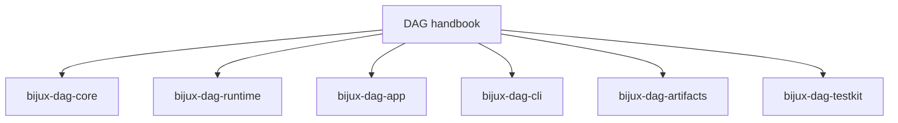

# DAG Handbook

`bijux-dag` is the graph execution and evidence subsystem in `bijux-core`. It
owns deterministic DAG semantics, run/artifact identity, replay classification,
and diff classification.

This handbook is optimized for operational questions that need hard answers:

- what changed (`graph`, `run`, or `artifact`)
- whether replay stayed equivalent, drifted, or is incomplete
- where ownership boundaries are between DAG crates

<a class="md-button md-button--primary" href="packages/bijux-dag-core.md">Open the kernel package</a>
<a class="md-button" href="packages/bijux-dag-runtime.md">Open the runtime package</a>
<a class="md-button" href="packages/bijux-dag-app.md">Open the app package</a>

## Visual Summary

## Package Destinations

- [`bijux-dag-core`](packages/bijux-dag-core.md) owns graph truth and planner lowering
- [`bijux-dag-runtime`](packages/bijux-dag-runtime.md) owns execution policy, replay, and diagnostics
- [`bijux-dag-app`](packages/bijux-dag-app.md) owns command orchestration and response shaping
- [`bijux-dag-cli`](packages/bijux-dag-cli.md) owns the thin executable wrapper
- [`bijux-dag-artifacts`](packages/bijux-dag-artifacts.md) owns artifact identity, integrity, and lifecycle helpers
- [`bijux-dag-testkit`](packages/bijux-dag-testkit.md) owns shared deterministic fixtures

## Code Anchors

- `crates/bijux-dag-cli/src/main.rs`
- `crates/bijux-dag-app/src/`
- `crates/bijux-dag-core/src/`
- `crates/bijux-dag-runtime/src/`
- `crates/bijux-dag-artifacts/src/`

## Main Paths

- [Foundation](foundation/index.md)
- [Architecture](architecture/index.md)
- [Interfaces](interfaces/index.md)
- [Operations](operations/index.md)
- [Quality](quality/index.md)

## Related Handbooks

- [Repository Handbook](../bijux-core/index.md)
- [CLI Handbook](../bijux-cli/index.md)
- [Maintainer Handbook](../bijux-dev/index.md)

## Contract Anchors

- [Planner Contract](../spec/PLANNER_CONTRACT.md)
- [Replay Contract](../spec/REPLAY_CONTRACT.md)
