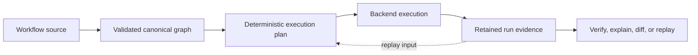
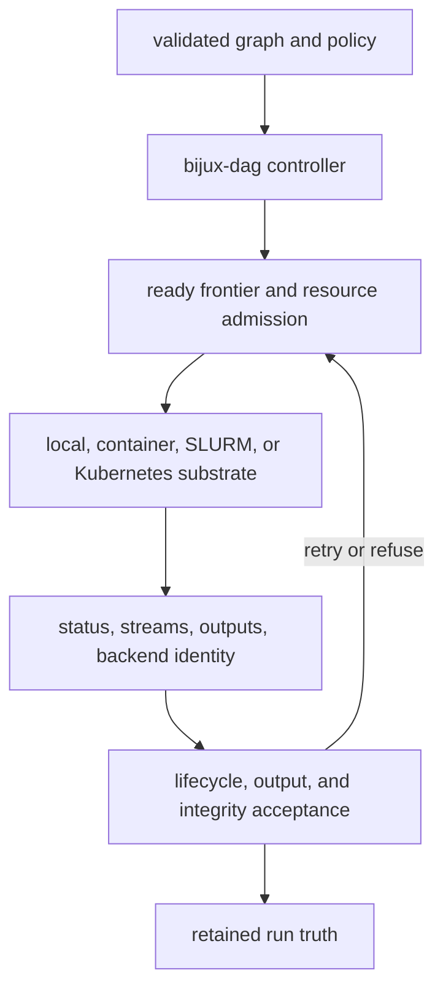

# DAG Handbook

`bijux-dag` v0.4.1 is a local-first DAG runtime for reproducible workflows
with explicit graph contracts, deterministic execution records, verified
artifacts, cache explanation, and replayable run bundles.
The [Replay Contract](../spec/REPLAY_CONTRACT.md) defines the replay authority.

Inside `bijux-core`, that promise covers graph validation, execution planning,
local run orchestration, replay, artifact identity, evidence inspection, cache
reasoning, and changed-run comparison.

The product boundary covers DAG behavior itself: what is admitted, what is
executed, which evidence is retained, and which crate owns each decision.

## v0.4.0 Surface Truth Table

The supported operator boundary is the visible `bijux-dag --help` surface for
local DAG work:

- `validate`, `plan`, `run`, `replay`
- `runs`, `artifact`, `artifact-inspect`, `diff`, `explain`
- `verify`, `doctor`, `cache`, `version`, `commands`, `completions`

That stable lane is intentionally local-first. Repository-owned experimental,
simulated, and maintainer-only routes still exist, but they are deliberate
opt-in lanes rather than the default product story.

Use [Release Boundary](foundation/release-boundary.md) for the exact lane
classification, [Generated CLI Reference](interfaces/generated-cli-reference.md)
for the stable command surface generated from the live binary, and
[Gated Command Inventory](interfaces/gated-command-inventory.md)
when you deliberately need the experimental, simulated, or internal route
inventory.

The retained evidence is part of the product result, not incidental logging.
Validation can stop before execution; execution is not accepted as
reproducible until its artifacts and identity-bearing records can be verified.

## Result Acceptance

| Boundary | Accepted when | Refused when |
| --- | --- | --- |
| graph | schema, identifiers, dependencies, and declared contracts validate | the source is ambiguous, cyclic, invalid, or incompatible |
| plan | canonical graph meaning and execution identity are derivable | planning cannot preserve declared dependency or policy meaning |
| node attempt | the adapter result reaches a valid terminal transition | launch, timeout, cancellation, retry, or lifecycle rules fail |
| output | every required declaration, path, hash, and proof is satisfied | output is missing, undeclared, escaped, incomplete, or corrupt |
| cache entry | reusable evidence matches active identities and integrity rules | lookup reports an explainable miss or invalid proof |
| run | terminal counts, manifest, traces, output index, and run identity agree | retained evidence is incomplete or internally inconsistent |
| replay or comparison | the selected evidence is complete and compatible for the requested operation | identity or evidence gaps prevent a defensible result |

This acceptance chain is why a process exit code alone is not a DAG result.

## Controller And Substrate

The controller owns graph meaning, scheduling, lifecycle transitions, and
accepted run state. A backend owns substrate-specific preparation, launch,
observation, finalization, and cleanup. Scheduler or container status remains
provisional until the controller validates it against node, output, and
evidence contracts.

<a class="md-button md-button--primary" href="operations/first-run-tutorial.md">Start with the first-run tutorial</a>
<a class="md-button" href="operations/v0-4-0-release-notes.md">Read the v0.4.0 release notes</a>
<a class="md-button" href="interfaces/runnable-examples.md">Open executable examples</a>
<a class="md-button" href="packages/index.md">Open the package map</a>

## Start Here

| If you want to... | Open this page |
| --- | --- |
| get a working DAG run as fast as possible | [First-Run Tutorial](operations/first-run-tutorial.md) |
| browse real workflows with expected outputs | [Executable Examples](interfaces/runnable-examples.md) |
| check whether a command or backend is part of the shipped boundary | [Release Boundary](foundation/release-boundary.md) |
| understand retained run evidence on disk | [Run Evidence Layout](interfaces/run-evidence-layout.md) |
| understand graph, plan, execution, cache, and replay identity | [Reproducibility Model](interfaces/reproducibility-model.md) |
| find the owning crate before reading code | [DAG Packages](packages/index.md) |

## Product Proof Map

The public product sentence is only useful if a reader can trace each claim to
one concrete proof surface:

| Product claim | Where this handbook proves it |
| --- | --- |
| explicit graph contracts | [Graph Schema Reference](interfaces/graph-schema.md) and [First-Run Tutorial](operations/first-run-tutorial.md) |
| deterministic execution records | [Run Evidence Layout](interfaces/run-evidence-layout.md) and [Operator Workflows](interfaces/operator-workflows.md) |
| verified artifacts | [Artifact Contracts](interfaces/artifact-contracts.md) and [First-Run Tutorial](operations/first-run-tutorial.md) |
| cache explanation | [Cache Behavior Workflow](operations/cache-behavior-workflow.md) and [CLI Surface](interfaces/cli-surface.md) |
| replayable run bundles | [Reproducibility Model](interfaces/reproducibility-model.md), [Failure Recovery](operations/failure-recovery.md), and [Replay Contract](../spec/REPLAY_CONTRACT.md) |

## Packages In This Product

The current public DAG crate family is:

- `bijux-dag-core` for graph truth and planner inputs
- `bijux-dag-artifacts` for run evidence, integrity, and lifecycle helpers
- `bijux-dag-runtime` for execution policy, replay, cache, and diagnostics
- `bijux-dag-app` for command orchestration and response shaping
- `bijux-dag-cli` for the thin `bijux-dag` executable wrapper

`bijux-dag-testkit` remains repository-internal support for deterministic DAG
fixtures and shared assertions.

For the public-versus-private crate boundary behind that split, use
[`../bijux-core/foundation/package-boundary.md`](../bijux-core/foundation/package-boundary.md).

## Honest Boundary Notes

- `run --backend slurm` is part of the current release line for
  shared-filesystem environments where scheduled workers can reopen the
  retained run directory.
- `run --backend kubernetes` is part of the current release line for
  container-node execution through Kubernetes Jobs with shared persistent
  storage.
- Experimental routes remain callable by explicit path and are visible through
  `bijux-dag commands --lane experimental`.
- Simulated and maintainer namespaces require explicit opt-in through
  `BIJUX_DAG_ENABLE_SIMULATED=1` or `BIJUX_DAG_ENABLE_INTERNAL=1` together with
  deliberate lane inventory.
- If the next question sounds like a security claim rather than a workflow
  claim, route it to
  [Execution Security And Isolation](operations/security-isolation-truth.md)
  before treating a flag or backend as an enforced boundary.

## Operate The Product

- [CLI Surface](interfaces/cli-surface.md) for the operator contract
- [Graph Schema Reference](interfaces/graph-schema.md) for authoring
  truth
- [Cache Behavior Workflow](operations/cache-behavior-workflow.md) for
  reuse, verification, and refusal behavior
- [Container Packaging Workflow](operations/container-packaging-workflow.md)
  for container-backed execution
- [Branching Bulletin Workflow](operations/branching-bulletin-workflow.md)
  for branch decisions, skipped lanes, and join behavior
- [Failure Recovery](operations/failure-recovery.md) for preserving and
  verifying an interrupted or failed run

## Adjacent Authorities

- [Repository Handbook](../bijux-core/index.md) — publication rules, shared
  release policy, and cross-product ownership.
- [Maintainer Handbook](../bijux-dev/index.md) — governance suites, release
  proof, and repository gates.
- [Future Direction](foundation/future-direction.md) — non-binding capability
  direction beyond shipped `v0.4.0` behavior.
