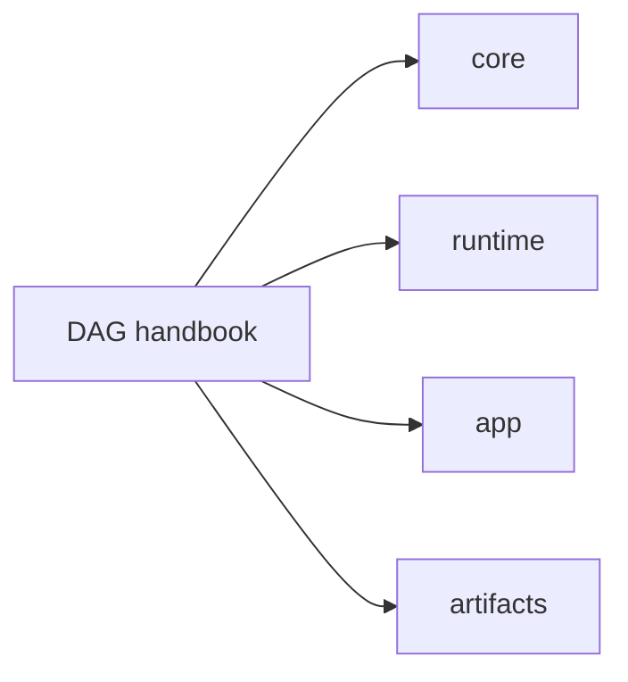

# DAG Handbook

`bijux-dag` is the graph execution and evidence subsystem in `bijux-core`. It
owns deterministic DAG semantics, run and artifact identity, replay
classification, and diff classification. The `v0.4.0` release makes the DAG
Rust crate family public for the first time.

Runtime identity in manifests, provenance, replay, and cache fingerprints is
resolved from build metadata. Changing the shell directory around the compiled
binary is not supposed to rewrite DAG evidence identity.

The public operator contract is the visible `bijux-dag --help` surface. Hidden
simulation and maintainer namespaces remain in the repository for internal
coverage and evidence work, but they are not presented as stable `v0.4.0`
operator APIs.

Use this handbook when the question is about graph truth, execution policy,
replay outcomes, artifact behavior, or how the DAG crates divide ownership.

<a class="md-button md-button--primary" href="packages/bijux-dag-core.md">Open the kernel package</a>
<a class="md-button" href="packages/bijux-dag-runtime.md">Open the runtime package</a>
<a class="md-button" href="packages/bijux-dag-app.md">Open the app package</a>

## Package Map

## Package Destinations

- [`bijux-dag-core`](packages/bijux-dag-core.md) owns graph truth and planner lowering
- [`bijux-dag-runtime`](packages/bijux-dag-runtime.md) owns execution policy, replay, and diagnostics
- [`bijux-dag-app`](packages/bijux-dag-app.md) owns command orchestration and response shaping
- [`bijux-dag-cli`](packages/bijux-dag-cli.md) owns the thin executable wrapper
- [`bijux-dag-artifacts`](packages/bijux-dag-artifacts.md) owns artifact identity, integrity, and lifecycle helpers
- [`bijux-dag-testkit`](packages/bijux-dag-testkit.md) owns shared deterministic fixtures

## Code Anchors

- `crates/bijux-dag-cli/src/main.rs`
- `crates/bijux-dag-app/src/`
- `crates/bijux-dag-core/src/`
- `crates/bijux-dag-runtime/src/`
- `crates/bijux-dag-artifacts/src/`

## Main Paths

- [Foundation](foundation/index.md)
- [Architecture](architecture/index.md)
- [Interfaces](interfaces/index.md)
- [Operations](operations/index.md)
- [Quality](quality/index.md)

## Related Handbooks

- [Repository Handbook](../bijux-core/index.md)
- [CLI Handbook](../bijux-cli/index.md)
- [Maintainer Handbook](../bijux-dev/index.md)

## Contract Anchors

- [Planner Contract](../spec/PLANNER_CONTRACT.md)
- [Replay Contract](../spec/REPLAY_CONTRACT.md)
