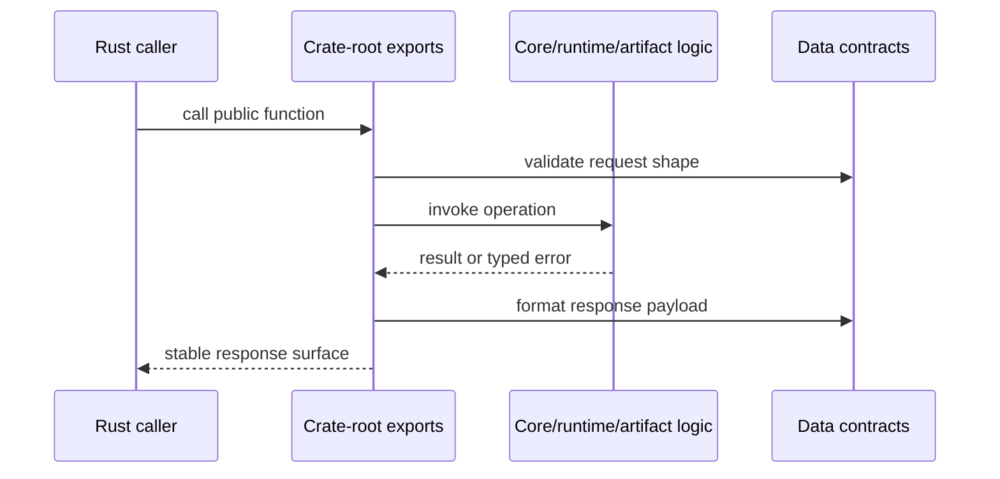

# API Surface

DAG Rust APIs are exposed through crate roots and explicit re-exports, allowing
consumers to use semantic, runtime, and artifact capabilities without importing
internal module paths.

## Visual Summary

## API Surfaces by Crate

- `bijux-dag-core`: graph model, validation, canonicalization, planner lowering
- `bijux-dag-runtime`: execution engine, scheduling, replay/diff helpers, policy
- `bijux-dag-artifacts`: run-dir lifecycle, artifact integrity, persistence helpers
- `bijux-dag-app`: command orchestration entrypoints (`dag_command`, `dag_run`)

## Code Anchors

- `crates/bijux-dag-core/src/lib.rs`
- `crates/bijux-dag-runtime/src/lib.rs`
- `crates/bijux-dag-artifacts/src/lib.rs`
- `crates/bijux-dag-app/src/lib.rs`

## API Surface Rules

- favor crate-root exports for external integration code
- avoid coupling to internal modules outside documented contracts
- update interface docs when root export behavior changes

## Next Reads

- [Public Imports](public-imports.md)
- [Data Contracts](data-contracts.md)
- [Code Navigation](../architecture/code-navigation.md)
