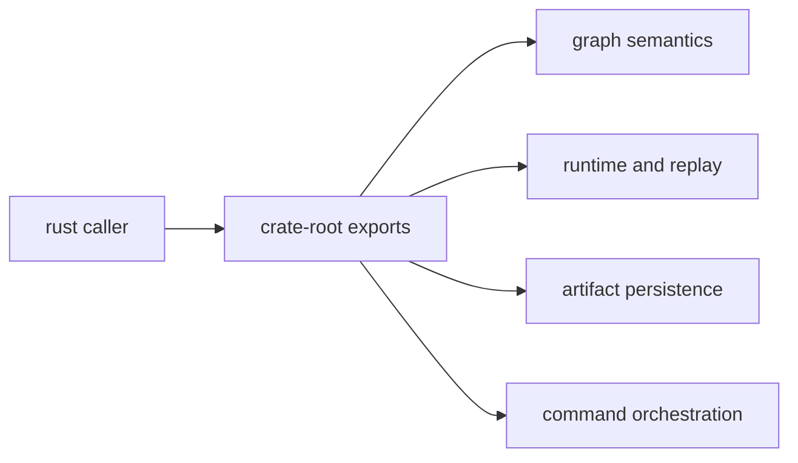

# API Surface

This page explains the Rust-facing DAG surfaces that matter when another crate
needs graph, runtime, or artifact behavior.

The boundary is straightforward: depend on crate-root exports, `stable`, or
`prelude`, not on hidden compatibility modules.

For the runtime crate in particular, visible module-level imports are limited to
`stable`, `prelude`, `experimental`, and `simulated_platform`. Modeled backend,
governance, and evidence-oriented helper exports may remain available for
repository-owned code, but they are intentionally hidden from the default docs
surface.

## API Map

## API Surfaces by Crate

- `bijux-dag-core`: graph model, validation, canonicalization, planner lowering
- `bijux-dag-runtime`: execution engine, scheduling, replay/diff helpers, policy
- `bijux-dag-artifacts`: run-dir lifecycle, artifact integrity, persistence helpers
- `bijux-dag-app`: command orchestration entrypoints (`dag_command`, `dag_run`)

## Import Lanes

- `crate root`: best for focused imports where only a few stable items are needed
- `stable`: explicit long-lived surface for Rust integrations that want a named compatibility lane
- `prelude`: common workflow imports for parse/plan/run/read orchestration
- `experimental`: opt-in lane behind the crate-local `experimental-public-api` feature
- `simulated_platform`: explicit modeled-platform lane for maintainer and
  evidence workflows only

## Code Anchors

- `crates/bijux-dag-core/src/lib.rs`
- `crates/bijux-dag-runtime/src/lib.rs`
- `crates/bijux-dag-artifacts/src/lib.rs`
- `crates/bijux-dag-app/src/lib.rs`

## API Surface Rules

- favor crate-root exports, `stable`, or `prelude` for external integration code
- avoid coupling to hidden compatibility modules outside documented contracts
- update interface docs when root export behavior changes

## Reading Rule

Use this page when Rust integration code needs DAG behavior and the main
question is which crate root owns the public call.

## Next Reads

- [Public Imports](public-imports.md)
- [Data Contracts](data-contracts.md)
- [Code Navigation](../architecture/code-navigation.md)
