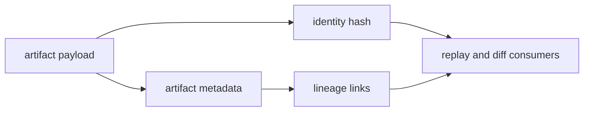

# Artifact Contracts

Artifact contracts tie payload bytes, metadata, identity, and lineage into one
verifiable evidence surface.

## Visual Summary

## Contract Surfaces

- outputs index and run outputs index
- run manifest and provenance records
- node trace and input/output index files
- integrity proofs and schema validation descriptors

## Code Anchors

- `crates/bijux-dag-artifacts/src/storage/models.rs`
- `crates/bijux-dag-artifacts/src/integrity/hash.rs`
- `crates/bijux-dag-artifacts/src/integrity/index.rs`
- `crates/bijux-dag-artifacts/src/integrity/proof.rs`
- `crates/bijux-dag-runtime/src/artifacts/`

## Contract Rules

- hash and lineage mismatches must be surfaced explicitly
- missing required evidence must not be treated as equivalent
- schema-bearing artifact files require compatibility review on shape changes

## Next Reads

- [Data Contracts](data-contracts.md)
- [State and Persistence](../architecture/state-and-persistence.md)
- [Documentation Standards](../quality/documentation-standards.md)
